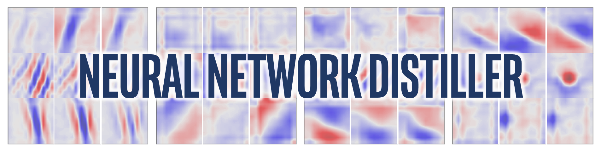

<center> </center>

[](https://github.com/NervanaSystems/distiller/blob/master/LICENSE)
[](https://zenodo.org/badge/latestdoi/130871393)

<div align="center">
  <h3>
    <a href="https://github.com/NervanaSystems/distiller/wiki">
      Wiki and tutorials
    </a>
    <span> | </span>
    <a href="https://nervanasystems.github.io/distiller/index.html">
      Documentation
    </a>
    <span> | </span>
    <a href="#getting-started">
      Getting Started
    </a>
    <span> | </span>
    <a href="https://nervanasystems.github.io/distiller/algo_pruning/index.html">
      Algorithms
    </a>
    <span> | </span>
    <a href="https://nervanasystems.github.io/distiller/design/index.html">
      Design
    </a>
    <span> | </span>
    <a href="https://nervanasystems.github.io/distiller/model_zoo/index.html">
      Model Zoo
    </a>
  </h3>
</div>

**Distiller** is an open-source Python package for neural network compression research.

Network compression can reduce the memory footprint of a neural network, increase its inference speed and save energy. Distiller provides a [PyTorch](http://pytorch.org/) environment for prototyping and analyzing compression algorithms, such as sparsity-inducing methods and low-precision arithmetic.

## Table of Contents

* [Feature set](#feature-set)
* [Installation](#installation)
  + [Clone Distiller](#clone-distiller)
  + [Create a Python virtual environment](#create-a-python-virtual-environment)
  + [Install dependencies](#install-dependencies)
* [Getting Started](#getting-started)
  + [Example invocations of the sample application](#example-invocations-of-the-sample-application)
  + [Explore the sample Jupyter notebooks](#explore-the-sample-jupyter-notebooks)
* [Set up the classification datasets](#set-up-the-classification-datasets)
* [Running the tests](#running-the-tests)
* [Generating the HTML documentation site](#generating-the-html-documentation-site)
* [Versioning](#versioning)
* [License](#license)
* [Citation](#citation)
* [Acknowledgments](#acknowledgments)
* [Disclaimer](#disclaimer)

## Feature set

Highlighted features:
* Element-wise pruning (defined per layer) using magnitude thresholding, sensitivity thresholding, and target sparsity level.
* Structured pruning:
  - Convolution: 2D (kernel-wise), 3D (filter-wise), 4D (layer-wise), and channel-wise structured pruning.  
  - Fully-connected: column-wise and row-wise structured pruning.
  - Filter-ranking and pruning is implemented, and can be easily extended to support ranking of channels or other structures.
  - Distiller is designed to be extended to support new structures (e.g. block pruning).
* Pruned elements are automatically disconnected from the network and do not participate in both forward and backward passes.
* Model thinning (removal of layers, filters, and channels) is partially supported and will be extended with future PyTorch versions.  You can export thinned models to inference frameworks using ONNX export.
* L1-norm element-wise regularization, and Group Lasso regularization for all of the pruning structures (2D, 3D, etc.).     
* Flexible scheduling of pruning, regularization, and learning rate decay (compression scheduling).
  - One-shot and iterative pruning (and fine-tuning) are supported.
  - Automatic gradual pruning schedule is supported for element-wise pruning, and can be extended to support structures.
  - The compression schedule is expressed in a YAML file so that a single file captures the details of experiments.  This [dependency injection](https://en.wikipedia.org/wiki/Dependency_injection) design decouples the Distiller scheduler and library from future extensions of algorithms.
* Quantization:
  - Automatic mechanism to transform existing models to quantized versions, with customizable bit-width configuration for different layers. No need to re-write the model for different quantization methods.
  - Support for [training with quantization](https://nervanasystems.github.io/distiller/quantization/index.html#training-with-quantization) in the loop
  - One-shot 8-bit quantization of trained full-precision models
* Training with [knowledge distillation](https://nervanasystems.github.io/distiller/knowledge_distillation/index.html), in conjunction with the other available pruning / regularization / quantization methods.
* Export statistics summaries using Pandas dataframes, which makes it easy to slice, query, display and graph the data.
* A set of [Jupyter notebooks](https://nervanasystems.github.io/distiller/jupyter/index.html) to plan experiments and analyze compression results.  The graphs and visualizations you see on this page originate from the included Jupyter notebooks.  
  + Take a look at [this notebook](https://github.com/NervanaSystems/distiller/blob/master/jupyter/alexnet_insights.ipynb), which compares visual aspects of dense and sparse Alexnet models.
  + [This notebook](https://github.com/NervanaSystems/distiller/blob/master/jupyter/model_summary.ipynb) creates performance indicator graphs from model data.
* Sample implementations of published research papers, using library-provided building blocks.  See the  research papers discussions in our [model-zoo](https://nervanasystems.github.io/distiller/model_zoo/index.html).
* Element-wise and filter-wise pruning sensitivity analysis (using L1-norm thresholding). Examine the data from some of the networks we analyzed, using [this notebook](https://github.com/NervanaSystems/distiller/blob/master/jupyter/sensitivity_analysis.ipynb).
* Logging to the console, text file and TensorBoard-formatted file.


## Installation

These instructions will help get Distiller up and running on your local machine.
1. [Clone Distiller](#clone-distiller)
2. [Create a Python virtual environment](#create-a-python-virtual-environment)
3. [Install dependencies](#install-dependencies)

Notes:
- Distiller has only been tested on Ubuntu 16.04 LTS, and with Python 3.5.
- If you are not using a GPU, you might need to make small adjustments to the code.

### Clone Distiller
Clone the Distiller code repository from github:
```
$ git clone https://github.com/NervanaSystems/distiller.git
```
The rest of the documentation that follows, assumes that you have cloned your repository to a directory called ```distiller```. <br>

### Create a Python virtual environment
We recommend using a [Python virtual environment](https://docs.python.org/3/library/venv.html#venv-def), but that of course, is up to you.
There's nothing special about using Distiller in a virtual environment, but we provide some instructions, for completeness.<br>
Before creating the virtual environment, make sure you are located in directory ```distiller```.  After creating the environment, you should see a directory called ```distiller/env```.
<br>
#### Using virtualenv
If you don't have virtualenv installed, you can find the installation instructions [here](https://packaging.python.org/guides/installing-using-pip-and-virtualenv/).

To create the environment, execute:
```
$ python3 -m virtualenv env
```
This creates a subdirectory named ```env``` where the python virtual environment is stored, and configures the current shell to use it as the default python environment.

#### Using venv
If you prefer to use ```venv```, then begin by installing it:
```
$ sudo apt-get install python3-venv
```
Then create the environment:
```
$ python3 -m venv env
```
As with virtualenv, this creates a directory called ```distiller/env```.<br>

#### Activate the environment
The environment activation and deactivation commands for ```venv``` and ```virtualenv``` are the same.<br>
**!NOTE: Make sure to activate the environment, before proceeding with the installation of the dependency packages:<br>**
```
$ source env/bin/activate
```

### Install dependencies
Finally, install Distiller's dependency packages using ```pip3```:
```
$ pip3 install -r requirements.txt
```
PyTorch is included in the ```requirements.txt``` file, and will currently download PyTorch version 0.4.0 for CUDA 8.0.  This is the setup we've used for testing Distiller.

## Getting Started

You can jump head-first into some limited examples of network compression, to get a feeling for the library without too much investment on your part.  

Distiller comes with a sample application for compressing image classification DNNs, ```compress_classifier.py``` located at ```distiller/examples/classifier_compression```.

We'll show you how to use it for some simple use-cases, and will point you to some ready-to-go Jupyter notebooks.

For more details, there are some other resources you can refer to:
+ [Model zoo](https://nervanasystems.github.io/distiller/model_zoo/index.html)
+ [Compression scheduling](https://nervanasystems.github.io/distiller/schedule/index.html)
+ [Usage](https://nervanasystems.github.io/usage/index.html)


### Example invocations of the sample application
+ [Training-only](#training-only)
+ [Getting parameter statistics of a sparsified model](#getting-parameter-statistics-of-a-sparsified-model)
+ [8-bit quantization](#8-bit-quantization)

#### Training-only
The following will invoke training-only (no compression) of a network named 'simplenet' on the CIFAR10 dataset.  This is roughly based on TorchVision's sample Imagenet training application, so it should look familiar if you've used that application.  In  this example we don't invoke any compression mechanisms: we just train because for fine-tuning after pruning, training is an essential part.<br>  
Note that the first time you execute this command, the CIFAR10 code will be downloaded to your machine, which may take a bit of time - please let the download process proceed to completion.

The path to the CIFAR10 dataset is arbitrary, but in our examples we place the datasets in the same directory level as distiller (i.e. ```../../../data.cifar10```).

First, change to the sample directory, then invoke the application:
```
$ cd distiller/examples/classifier_compression
$ python3 compress_classifier.py --arch simplenet_cifar ../../../data.cifar10 -p 30 -j=1 --lr=0.01
```

You can use a TensorBoard backend to view the training progress (in the diagram below we show a couple of training sessions with different LR values).  For compression sessions, we've added tracing of activation and parameter sparsity levels, and regularization loss.
<center> </center>


#### Getting parameter statistics of a sparsified model
We've included in the git repository a few checkpoints of a ResNet20 model that we've trained with 32-bit floats.  Let's load the checkpoint of a model that we've trained with channel-wise Group Lasso regularization.<br>
With the following command-line arguments, the sample application loads the model (```--resume```)  and prints statistics about the model weights (```--summary=sparsity```).  This is useful if you want to load a previously pruned model, to examine the weights sparsity statistics, for example.  Note that when you *resume* a stored checkpoint, you still need to tell the application which network architecture the checkpoint uses (```-a=resnet20_cifar```):
```
$ python3 compress_classifier.py --resume=../ssl/checkpoints/checkpoint_trained_ch_regularized_dense.pth.tar -a=resnet20_cifar ../../../data.cifar10 --summary=sparsity
```
<center> </center>

You should see a text table detailing the various sparsities of the parameter tensors.  The first column is the parameter name, followed by its shape, the number of non-zero elements (NNZ) in the dense model, and in the sparse model.  The next set of columns show the column-wise, row-wise, channel-wise, kernel-wise, filter-wise and element-wise sparsities.
<br>
Wrapping it up are the standard-deviation, mean, and mean of absolute values of the elements.

In the [Compression Insights notebook](https://github.com/NervanaSystems/distiller/blob/master/jupyter/compression_insights.ipynb) we use matplotlib to plot a bar chart of this summary, that indeed show non-impressive footprint compression.

<center> </center>


Although the memory footprint compression is very low, this model actually saves 26.6% of the MACs compute.  
```
$ python3 compress_classifier.py --resume=../ssl/checkpoints/checkpoint_trained_channel_regularized_resnet20_finetuned.pth.tar -a=resnet20_cifar ../../../data.cifar10 --summary=compute
```
<center> </center>

#### 8-bit quantization
This example performs 8-bit quantization of ResNet20 for CIFAR10.  We've included in the git repository the checkpoint of a ResNet20 model that we've trained with 32-bit floats, so we'll take this model and quantize it:

```
$ python3 compress_classifier.py -a resnet20_cifar ../../../data.cifar10 --resume ../examples/ssl/checkpoints/checkpoint_trained_dense.pth.tar --quantize --evaluate
```

The command-line above will save a checkpoint named `quantized_checkpoint.pth.tar` containing the quantized model parameters.

### Explore the sample Jupyter notebooks
The set of notebooks that come with Distiller is described [here](https://nervanasystems.github.io/distiller/jupyter/index.html#using-the-distiller-notebooks), which also explains the steps to install the Jupyter notebook server.<br>
After installing and running the server, take a look at the [notebook](https://github.com/NervanaSystems/distiller/blob/master/jupyter/sensitivity_analysis.ipynb) covering pruning sensitivity analysis.

Sensitivity analysis is a long process and this notebook loads CSV files that are the output of several sessions of sensitivity analysis.
<center> </center>

## Set up the classification datasets
The sample application for compressing image classification DNNs, ```compress_classifier.py``` located at ```distiller/examples/classifier_compression```, uses both [CIFAR10](https://www.cs.toronto.edu/~kriz/cifar.html) and [ImageNet](http://www.image-net.org/) image datasets.<br>

The ```compress_classifier.py``` application will download the CIFAR10 automatically the first time you try to use it (thanks to TorchVision).  The example invocations used  throughout Distiller's documentation assume that you have downloaded the images to directory ```distiller/../data.cifar10```, but you can place the images anywhere you want (you tell ```compress_classifier.py``` where the dataset is located - or where you want the application to download the dataset to - using a command-line parameter).

ImageNet needs to be [downloaded](http://image-net.org/download) manually, due to copyright issues.  Facebook has created a [set of scripts](https://github.com/facebook/fb.resnet.torch/blob/master/INSTALL.md#download-the-imagenet-dataset) to help download and extract the dataset.

Again, the Distiller documentation assumes the following directory structure for the datasets, but this is just a suggestion:
```
distiller
  examples
    classifier_compression
data.imagenet/
    train/
    val/
data.cifar10/
    cifar-10-batches-py/
        batches.meta
        data_batch_1
        data_batch_2
        data_batch_3
        data_batch_4
        data_batch_5
        readme.html
        test_batch
```


## Running the tests
We are currently light-weight on test and this is an area where contributions will be much appreciated.<br>
There are two types of tests: system tests and unit-tests.  To invoke the unit tests:
```
$ cd distiller/tests
$ pytest
```

We use CIFAR10 for the system tests, because its size makes for quicker tests.  To invoke the system tests, you need to provide a path to the CIFAR10 dataset which you've already downloaded.  Alternatively, you may invoke ```full_flow_tests.py``` without specifying the location of the CIFAR10 dataset and let the test download the dataset (for the first invocation only).  Note that ```--cifar1o-path``` defaults to the current directory. <br>
The system tests are not short, and are even longer if the test needs to download the dataset.  

```
$ cd distiller/tests
$ python full_flow_tests.py --cifar10-path=<some_path>
```

The script exits with status 0 if all tests are successful, or status 1 otherwise.

## Generating the HTML documentation site
Install mkdocs and the required packages by executing:

```
$ pip3 install -r doc-requirements.txt
```

To build the project documentation run:
```
$ cd distiller/docs-src
$ mkdocs build --clean
```
This will create a folder named 'site' which contains the documentation website.
Open distiller/docs/site/index.html to view the documentation home page.

## Built With

* [PyTorch](http://pytorch.org/) - The tensor and neural network framework used by Distiller.
* [Jupyter](http://jupyter.org/) - Notebook serving.
* [TensorBoard](https://www.tensorflow.org/programmers_guide/summaries_and_tensorboard) - Used to view training graphs.


## Versioning

We use [SemVer](http://semver.org/) for versioning. For the versions available, see the [tags on this repository](https://github.com/NervanaSystems/distiller/tags).

## License

This project is licensed under the Apache License 2.0 - see the [LICENSE.md](LICENSE.md) file for details

## Citation

If you used Distiller for your work, please use the following citation:

```
@misc{neta_zmora_2018_1297430,
  author       = {Neta Zmora and
                  Guy Jacob and
                  Gal Novik},
  title        = {Neural Network Distiller},
  month        = jun,
  year         = 2018,
  doi          = {10.5281/zenodo.1297430},
  url          = {https://doi.org/10.5281/zenodo.1297430}
}
```

## Acknowledgments

Any published work is built on top of the work of many other people, and the credit belongs to too many people to list here.
* The Python and PyTorch developer communities have shared many invaluable insights, examples and ideas on the Web.
* The authors of the research papers implemented in the [Distiller model-zoo](https://nervanasystems.github.io/distiller/model_zoo/index.html) have shared their research ideas, theoretical background and results.


## Disclaimer
Distiller is released as a reference code for research purposes. It is not an official Intel product, and the level of quality and support may not be as expected from an official product. Additional algorithms and features are planned to be added to the library. Feedback and contributions from the open source and research communities are more than welcome.
