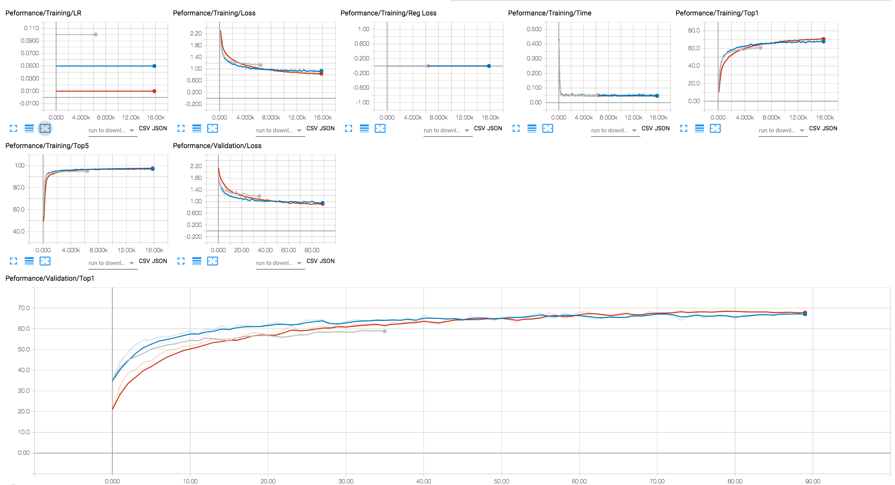
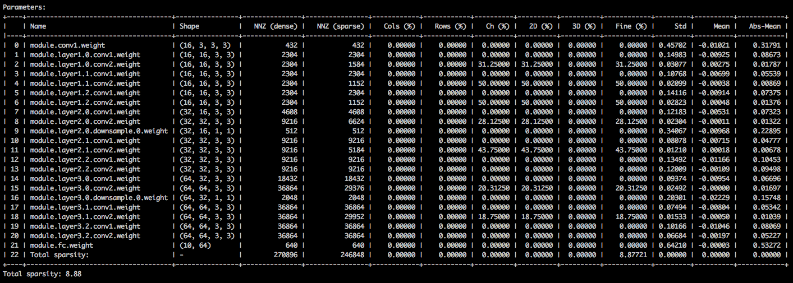
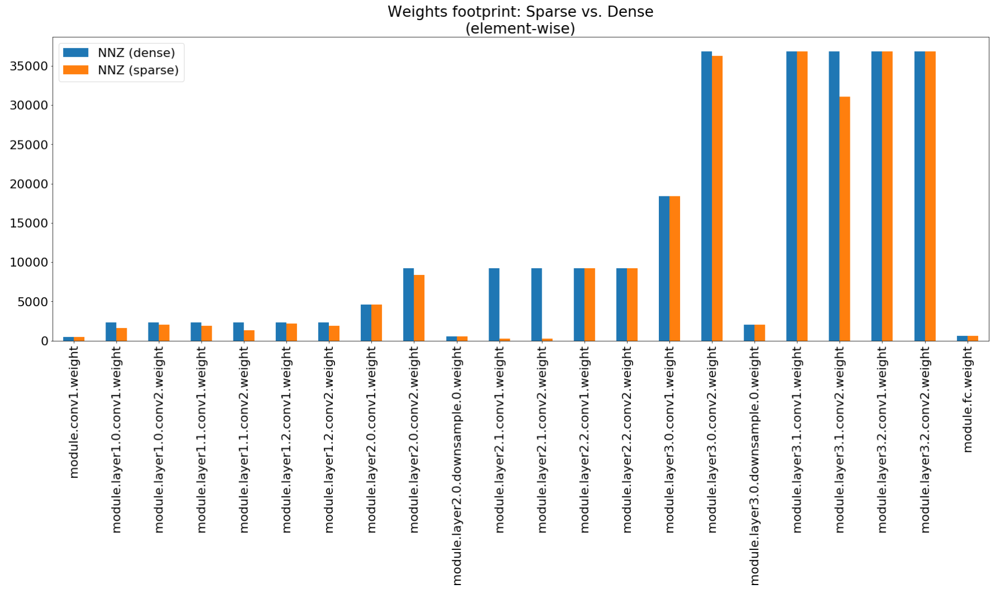
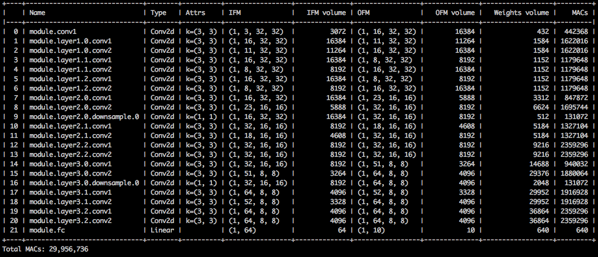
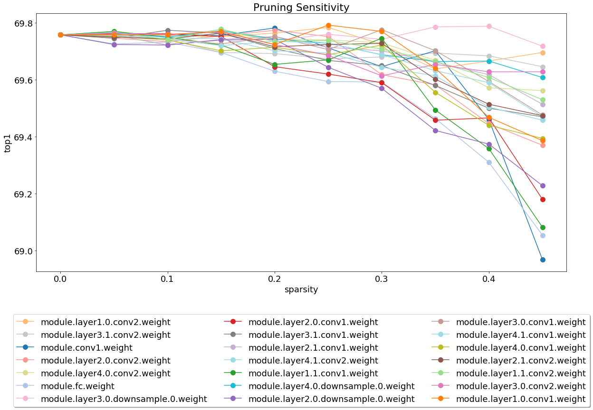

<center> </center>

[](https://github.com/NervanaSystems/distiller/blob/master/LICENSE)
[](https://zenodo.org/badge/latestdoi/130871393)

<div align="center">
  <h3>
    <a href="https://github.com/NervanaSystems/distiller/wiki">
      Wiki and tutorials
    </a>
    <span> | </span>
    <a href="https://nervanasystems.github.io/distiller/index.html">
      Documentation
    </a>
    <span> | </span>
    <a href="#getting-started">
      Getting Started
    </a>
    <span> | </span>
    <a href="https://nervanasystems.github.io/distiller/algo_pruning.html">
      Algorithms
    </a>
    <span> | </span>
    <a href="https://nervanasystems.github.io/distiller/design.html">
      Design
    </a>
    <span> | </span>
    <a href="https://github.com/NervanaSystems/distiller/wiki/Frequently-Asked-Questions-(FAQ)">
      FAQ
    </a>
  </h3>
</div>

**Distiller** is an open-source Python package for neural network compression research.

Network compression can reduce the memory footprint of a neural network, increase its inference speed and save energy. Distiller provides a [PyTorch](http://pytorch.org/) environment for prototyping and analyzing compression algorithms, such as sparsity-inducing methods and low-precision arithmetic.

#### Note on Release 0.3 - Possible BREAKING Changes

As of release 0.3, we've moved some code around to enable proper packaging and installation of Distiller. In addition, we updated Distiller to support PyTorch 1.X, which might also cause older code to break due to some API changes.  
If updating from an earlier revision of the code, please make sure to follow the instructions in the [install](#install-the-package) section to make sure proper installation of Distiller and all dependencies.


## Table of Contents

- [Table of Contents](#table-of-contents)
- [Highlighted features](#highlighted-features)
- [Installation](#installation)
  - [Clone Distiller](#clone-distiller)
  - [Create a Python virtual environment](#create-a-python-virtual-environment)
    - [Using virtualenv](#using-virtualenv)
    - [Using venv](#using-venv)
    - [Activate the environment](#activate-the-environment)
  - [Install the package](#install-the-package)
  - [Required PyTorch Version](#required-pytorch-version)
- [Getting Started](#getting-started)
  - [Basic Usage Examples](#basic-usage-examples)
    - [Training-only](#training-only)
    - [Getting parameter statistics of a sparsified model](#getting-parameter-statistics-of-a-sparsified-model)
    - [Post-training quantization](#post-training-quantization)
  - [Explore the sample Jupyter notebooks](#explore-the-sample-jupyter-notebooks)
- [Running the tests](#running-the-tests)
- [Generating the HTML documentation site](#generating-the-html-documentation-site)
- [Built With](#built-with)
- [Versioning](#versioning)
- [License](#license)
- [Community](#community)
  - [Github projects using Distiller:](#github-projects-using-distiller)
  - [Research papers citing Distiller:](#research-papers-citing-distiller)
- [Acknowledgments](#acknowledgments)
- [Disclaimer](#disclaimer)

## Highlighted features
* **Automatic Compression**
  - [Automated Model Compression](https://github.com/NervanaSystems/distiller/blob/master/examples/auto_compression/amc) (AMC)
* **Weight pruning**
  - Element-wise pruning using magnitude thresholding, sensitivity thresholding, target sparsity level, and activation statistics 
* **Structured pruning**
  - Convolution: 2D (kernel-wise), 3D (filter-wise), 4D (layer-wise), and channel-wise structured pruning.  
  - Fully-connected: column-wise and row-wise structured pruning.
  - Structure groups (e.g. structures of 4 filters).
  - Structure-ranking with using weights or activations criteria (Lp-norm, APoZ, gradients, random, etc.).
  - Support for new structures (e.g. block pruning)
* **Control**
  - Soft (mask on forward-pass only) and hard pruning (permanently disconnect neurons)
  - Dual weight copies (compute loss on masked weights, but update unmasked weights)  
  - Model thinning (AKA "network garbage removal") to permanently remove pruned neurons and connections.
* **Schedule**
  - Flexible scheduling of pruning, regularization, and learning rate decay (compression scheduling)
  - One-shot and iterative pruning (and fine-tuning) are supported.
  - Easily control what is performed each training step (e.g. greedy layer by layer pruning to full model pruning). 
  - Automatic gradual schedule (AGP) for pruning individual connections and complete structures.
  - The compression schedule is expressed in a YAML file so that a single file captures the details of experiments.  This [dependency injection](https://en.wikipedia.org/wiki/Dependency_injection) design decouples the Distiller scheduler and library from future extensions of algorithms.
* Element-wise and filter-wise pruning **sensitivity analysis** (using L1-norm thresholding). Examine the data from some of the networks we analyzed, using [this notebook](https://github.com/NervanaSystems/distiller/blob/master/jupyter/sensitivity_analysis.ipynb).
* **Regularization**
  - L1-norm element-wise regularization
  - Group Lasso an group variance regularization   
* **Quantization**
  - Automatic mechanism to transform existing models to quantized versions, with customizable bit-width configuration for different layers. No need to re-write the model for different quantization methods.
  - [Post-training quantization](https://nervanasystems.github.io/distiller/usage/index.html##post-training-quantization) of trained full-precision models, dynamic and static (statistics-based)
  - Support for [quantization-aware training](https://nervanasystems.github.io/distiller/algo_quantization.html#quantization-aware-training) in the loop
* **Knowledge distillation**
  - Training with [knowledge distillation](https://nervanasystems.github.io/distiller/knowledge_distillation.html), in conjunction with the other available pruning / regularization / quantization methods.
* **Conditional computation**
  - Sample implementation of Early Exit
* **Low rank decomposition**
  - Sample implementation of [truncated SVD](https://github.com/NervanaSystems/distiller/blob/master/jupyter/truncated_svd.ipynb)
* Lottery Ticket Hypothesis training 
* Export statistics summaries using Pandas dataframes, which makes it easy to slice, query, display and graph the data.
* A set of [Jupyter notebooks](https://nervanasystems.github.io/distiller/jupyter/index.html) to plan experiments and analyze compression results.  The graphs and visualizations you see on this page originate from the included Jupyter notebooks.  
  + Take a look at [this notebook](https://github.com/NervanaSystems/distiller/blob/master/jupyter/alexnet_insights.ipynb), which compares visual aspects of dense and sparse Alexnet models.
  + [This notebook](https://github.com/NervanaSystems/distiller/blob/master/jupyter/model_summary.ipynb) creates performance indicator graphs from model data.
* Sample implementations of published research papers, using library-provided building blocks.  See the  research papers discussions in our [model-zoo](https://nervanasystems.github.io/distiller/model_zoo.html).
* Logging to the console, text file and TensorBoard-formatted file.
* Export to **ONNX** (export of quantized models pending ONNX standardization)

## Installation

These instructions will help get Distiller up and running on your local machine.
1. [Clone Distiller](#clone-distiller)
2. [Create a Python virtual environment](#create-a-python-virtual-environment)
3. [Install the package](#install-the-package)

Notes:
- Distiller has only been tested on Ubuntu 16.04 LTS, and with Python 3.5.
- If you are not using a GPU, you might need to make small adjustments to the code.

### Clone Distiller
Clone the Distiller code repository from github:
```
$ git clone https://github.com/NervanaSystems/distiller.git
```
The rest of the documentation that follows, assumes that you have cloned your repository to a directory called ```distiller```. <br>

### Create a Python virtual environment
We recommend using a [Python virtual environment](https://docs.python.org/3/library/venv.html#venv-def), but that of course, is up to you.
There's nothing special about using Distiller in a virtual environment, but we provide some instructions, for completeness.<br>
Before creating the virtual environment, make sure you are located in directory ```distiller```.  After creating the environment, you should see a directory called ```distiller/env```.
<br>
#### Using virtualenv
If you don't have virtualenv installed, you can find the installation instructions [here](https://packaging.python.org/guides/installing-using-pip-and-virtualenv/).

To create the environment, execute:
```
$ python3 -m virtualenv env
```
This creates a subdirectory named ```env``` where the python virtual environment is stored, and configures the current shell to use it as the default python environment.

#### Using venv
If you prefer to use ```venv```, then begin by installing it:
```
$ sudo apt-get install python3-venv
```
Then create the environment:
```
$ python3 -m venv env
```
As with virtualenv, this creates a directory called ```distiller/env```.<br>

#### Activate the environment
The environment activation and deactivation commands for ```venv``` and ```virtualenv``` are the same.<br>
**!NOTE: Make sure to activate the environment, before proceeding with the installation of the dependency packages:<br>**
```
$ source env/bin/activate
```

### Install the package

Finally, install the Distiller package and its dependencies using ```pip3```:
```
$ cd distiller
$ pip3 install -e .
```
This installs Distiller in "development mode", meaning any changes made in the code are reflected in the environment without re-running the install command (so no need to re-install after pulling changes from the Git repository).

### Required PyTorch Version

Distiller is tested using the default installation of PyTorch 1.3.1, which uses CUDA 10.1. We use TorchVision version 0.4.2. These are included in Distiller's `requirements.txt` and will be automatically installed when installing the Distiller package as listed above.

If you do not use CUDA 10.1 in your environment, please refer to [PyTorch website](https://pytorch.org/get-started/locally/) to install the compatible build of PyTorch 1.3.1 and torchvision 0.4.2.

## Getting Started

Distiller comes with sample applications and tutorials covering a range of model types:

| Model Type | Sparsity | Post-training quantization | Quantization-aware training | Auto Compression (AMC) |
|------------|:--------:|:--------------------------:|:---------------------------:|:----------------------:|
| [Image classification](https://github.com/NervanaSystems/distiller/tree/master/examples/classifier_compression) | :white_check_mark: | :white_check_mark: | :white_check_mark: | :white_check_mark: |
| [Word-level language model](https://github.com/NervanaSystems/distiller/tree/master/examples/word_language_model)| :white_check_mark: | :white_check_mark: | | |
| [Translation (GNMT)](https://github.com/NervanaSystems/distiller/tree/master/examples/GNMT) | | :white_check_mark: | | |
| [Recommendation System (NCF)](https://github.com/NervanaSystems/distiller/tree/master/examples/ncf) | |  :white_check_mark: | | |
| [Object Detection](https://github.com/NervanaSystems/distiller/tree/master/examples/object_detection_compression) |  :white_check_mark: | | | |

Head to the [examples](https://github.com/NervanaSystems/distiller/tree/master/examples) directory for more details.

Other resources to refer to, beyond the examples:
+ [Frequently-asked questions (FAQ)](https://github.com/NervanaSystems/distiller/wiki/Frequently-Asked-Questions-(FAQ))
+ [Model zoo](https://nervanasystems.github.io/distiller/model_zoo.html)
+ [Compression scheduling](https://nervanasystems.github.io/distiller/schedule.html)
+ [Usage](https://nervanasystems.github.io/distiller/usage.html)
+ [Preparing a model for quantization](https://nervanasystems.github.io/distiller/prepare_model_quant.html)
+ [Tutorial: Pruning Filters & Channels](https://nervanasystems.github.io/distiller/tutorial-struct_pruning.html)

### Basic Usage Examples

The following are simple examples using Distiller's image classifcation sample, showing some of Distiller's capabilities.

+ [Training-only](#training-only)
+ [Getting parameter statistics of a sparsified model](#getting-parameter-statistics-of-a-sparsified-model)
+ [Post-training quantization](#post-training-quantization)

#### Training-only
The following will invoke training-only (no compression) of a network named 'simplenet' on the CIFAR10 dataset.  This is roughly based on TorchVision's sample Imagenet training application, so it should look familiar if you've used that application.  In  this example we don't invoke any compression mechanisms: we just train because for fine-tuning after pruning, training is an essential part.<br>  
Note that the first time you execute this command, the CIFAR10 code will be downloaded to your machine, which may take a bit of time - please let the download process proceed to completion.

The path to the CIFAR10 dataset is arbitrary, but in our examples we place the datasets in the same directory level as distiller (i.e. ```../../../data.cifar10```).

First, change to the sample directory, then invoke the application:
```
$ cd distiller/examples/classifier_compression
$ python3 compress_classifier.py --arch simplenet_cifar ../../../data.cifar10 -p 30 -j=1 --lr=0.01
```

You can use a TensorBoard backend to view the training progress (in the diagram below we show a couple of training sessions with different LR values).  For compression sessions, we've added tracing of activation and parameter sparsity levels, and regularization loss.
<center> </center>

#### Getting parameter statistics of a sparsified model
We've included in the git repository a few checkpoints of a ResNet20 model that we've trained with 32-bit floats.  Let's load the checkpoint of a model that we've trained with channel-wise Group Lasso regularization.<br>
With the following command-line arguments, the sample application loads the model (```--resume```)  and prints statistics about the model weights (```--summary=sparsity```).  This is useful if you want to load a previously pruned model, to examine the weights sparsity statistics, for example.  Note that when you *resume* a stored checkpoint, you still need to tell the application which network architecture the checkpoint uses (```-a=resnet20_cifar```):
```
$ python3 compress_classifier.py --resume=../ssl/checkpoints/checkpoint_trained_ch_regularized_dense.pth.tar -a=resnet20_cifar ../../../data.cifar10 --summary=sparsity
```
<center> </center>

You should see a text table detailing the various sparsities of the parameter tensors.  The first column is the parameter name, followed by its shape, the number of non-zero elements (NNZ) in the dense model, and in the sparse model.  The next set of columns show the column-wise, row-wise, channel-wise, kernel-wise, filter-wise and element-wise sparsities.
<br>
Wrapping it up are the standard-deviation, mean, and mean of absolute values of the elements.

In the [Compression Insights notebook](https://github.com/NervanaSystems/distiller/blob/master/jupyter/compression_insights.ipynb) we use matplotlib to plot a bar chart of this summary, that indeed show non-impressive footprint compression.

<center> </center>


Although the memory footprint compression is very low, this model actually saves 26.6% of the MACs compute.  
```
$ python3 compress_classifier.py --resume=../ssl/checkpoints/checkpoint_trained_channel_regularized_resnet20_finetuned.pth.tar -a=resnet20_cifar ../../../data.cifar10 --summary=compute
```
<center> </center>

#### Post-training quantization
This example performs 8-bit quantization of ResNet20 for CIFAR10.  We've included in the git repository the checkpoint of a ResNet20 model that we've trained with 32-bit floats, so we'll take this model and quantize it:

```
$ python3 compress_classifier.py -a resnet20_cifar ../../../data.cifar10 --resume ../ssl/checkpoints/checkpoint_trained_dense.pth.tar --quantize-eval --evaluate
```

The command-line above will save a checkpoint named `quantized_checkpoint.pth.tar` containing the quantized model parameters. See more examples [here](https://github.com/NervanaSystems/distiller/blob/master/examples/quantization/post_train_quant/command_line.md).

### Explore the sample Jupyter notebooks
The set of notebooks that come with Distiller is described [here](https://nervanasystems.github.io/distiller/jupyter.html#using-the-distiller-notebooks), which also explains the steps to install the Jupyter notebook server.<br>
After installing and running the server, take a look at the [notebook](https://github.com/NervanaSystems/distiller/blob/master/jupyter/sensitivity_analysis.ipynb) covering pruning sensitivity analysis.

Sensitivity analysis is a long process and this notebook loads CSV files that are the output of several sessions of sensitivity analysis.
<center> </center>

## Running the tests
We are currently light-weight on test and this is an area where contributions will be much appreciated.<br>
There are two types of tests: system tests and unit-tests.  To invoke the unit tests:
```
$ cd distiller/tests
$ pytest
```

We use CIFAR10 for the system tests, because its size makes for quicker tests.  To invoke the system tests, you need to provide a path to the CIFAR10 dataset which you've already downloaded.  Alternatively, you may invoke ```full_flow_tests.py``` without specifying the location of the CIFAR10 dataset and let the test download the dataset (for the first invocation only).  Note that ```--cifar1o-path``` defaults to the current directory. <br>
The system tests are not short, and are even longer if the test needs to download the dataset.  

```
$ cd distiller/tests
$ python full_flow_tests.py --cifar10-path=<some_path>
```

The script exits with status 0 if all tests are successful, or status 1 otherwise.

## Generating the HTML documentation site
Install mkdocs and the required packages by executing:

```
$ pip3 install -r doc-requirements.txt
```

To build the project documentation run:
```
$ cd distiller/docs-src
$ mkdocs build --clean
```
This will create a folder named 'site' which contains the documentation website.
Open distiller/docs/site/index.html to view the documentation home page.

## Built With

* [PyTorch](http://pytorch.org/) - The tensor and neural network framework used by Distiller.
* [Jupyter](http://jupyter.org/) - Notebook serving.
* [TensorBoard](https://www.tensorflow.org/programmers_guide/summaries_and_tensorboard) - Used to view training graphs.
* [Cadene](https://github.com/Cadene/pretrained-models.pytorch) - Pretrained PyTorch models.

## Versioning

We use [SemVer](http://semver.org/) for versioning. For the versions available, see the [tags on this repository](https://github.com/NervanaSystems/distiller/tags).

## License

This project is licensed under the Apache License 2.0 - see the [LICENSE.md](LICENSE.md) file for details

## Community

### Github projects using Distiller:
- [DeGirum Pruned Models](https://github.com/DeGirum/pruned-models) - a repository containing pruned models and related information.

### Research papers citing Distiller:
- Hui Guan, Lin Ning, Zhen Lin, Xipeng Shen, Huiyang Zhou, Seung-Hwan Lim.<br>
*[In-Place Zero-Space Memory Protection for CNN](https://arxiv.org/abs/1910.14479)*,<br>
In Conference on Neural Information Processing Systems (NeurIPS), 2019.<br>
arXiv:1910.14479, 2019<br>
[code](https://github.com/guanh01/wot)

- Maxim Zemlyanikin, Alexander Smorkalov, Tatiana Khanova, Anna Petrovicheva, Grigory Serebryakov.<br>
*[512KiB RAM Is Enough! Live Camera Face Recognition DNN on MCU](http://openaccess.thecvf.com/content_ICCVW_2019/html/LPCV/Zemlyanikin_512KiB_RAM_Is_Enough_Live_Camera_Face_Recognition_DNN_on_ICCVW_2019_paper.html)*,<br>
In IEEE International Conference on Computer Vision (ICCV), 2019.

- Ziheng Wang, Jeremy Wohlwend, Tao Lei.<br>
*[Structured Pruning of Large Language Models](https://arxiv.org/abs/1910.04732)*,<br>
arXiv:1910.04732, 2019.

- Soroush Ghodrati, Hardik Sharma, Sean Kinzer, Amir Yazdanbakhsh, Kambiz Samadi, Nam Sung Kim, Doug Burger, Hadi Esmaeilzadeh.<br>
*[Mixed-Signal Charge-Domain Acceleration of Deep Neural networks through Interleaved Bit-Partitioned Arithmetic](https://arxiv.org/abs/1906.11915)*,<br>
arXiv:1906.11915, 2019.

- Gil Shomron, Tal Horowitz, Uri Weiser.<br>
*[SMT-SA: Simultaneous Multithreading in Systolic Arrays](https://ieeexplore.ieee.org/document/8742541)*,<br>
In IEEE Computer Architecture Letters (CAL), 2019.

- Shangqian Gao , Cheng Deng , and Heng Huang.<br>
 *[Cross Domain Model Compression by Structurally Weight Sharing](http://openaccess.thecvf.com/content_CVPR_2019/html/Gao_Cross_Domain_Model_Compression_by_Structurally_Weight_Sharing_CVPR_2019_paper.html),*<br>
 In The IEEE Conference on Computer Vision and Pattern Recognition (CVPR), 2019, pp. 8973-8982.
 
- Moin Nadeem, Wei Fang, Brian Xu, Mitra Mohtarami, James Glass.<br>
  *[FAKTA: An Automatic End-to-End Fact Checking System](https://arxiv.org/abs/1906.04164),*<br>
  In North American Chapter of the Association for Computational Linguistics (NAACL), 2019.

- Ahmed T. Elthakeb, Prannoy Pilligundla, Hadi Esmaeilzadeh.<br>
  *[SinReQ: Generalized Sinusoidal Regularization for Low-Bitwidth Deep Quantized Training](https://arxiv.org/abs/1905.01416),*<br>
  arXiv:1905.01416, 2019.
  [code](https://github.com/sinreq/sinreq_code)
  
- Goncharenko A., Denisov A., Alyamkin S., Terentev E.<br>
*[Trainable Thresholds for Neural Network Quantization](https://rd.springer.com/chapter/10.1007/978-3-030-20518-8_26),*<br>
In: Rojas I., Joya G., Catala A. (eds) Advances in Computational Intelligence Lecture Notes in Computer Science, vol 11507. Springer, Cham.  International Work-Conference on Artificial Neural Networks (IWANN 2019).

- Ahmed T. Elthakeb, Prannoy Pilligundla, Hadi Esmaeilzadeh.<br>
  *[Divide and Conquer: Leveraging Intermediate Feature Representations for Quantized Training of Neural Networks](https://arxiv.org/abs/1906.06033),*
  arXiv:1906.06033, 2019

- Ritchie Zhao, Yuwei Hu, Jordan Dotzel, Christopher De Sa, Zhiru Zhang.<br>
  *[Improving Neural Network Quantization without Retraining using Outlier Channel Splitting](https://arxiv.org/abs/1901.09504),*<br>
  arXiv:1901.09504, 2019<br>
  [Code](https://github.com/cornell-zhang/dnn-quant-ocs)

- Angad S. Rekhi, Brian Zimmer, Nikola Nedovic, Ningxi Liu, Rangharajan Venkatesan, Miaorong Wang, Brucek Khailany, William J. Dally, C. Thomas Gray.<br>
*[Analog/Mixed-Signal Hardware Error Modeling for Deep Learning Inference](https://research.nvidia.com/sites/default/files/pubs/2019-06_Analog/Mixed-Signal-Hardware-Error/40_2_Rekhi_AMS_ML.pdf)*,<br>
Nvidia Research, 2019.

- Norio Nakata.<br>
*[Recent Technical Development of Artificial Intelligence for Diagnostic Medical Imaging]( https://rd.springer.com/article/10.1007/s11604-018-0804-6)*,<br>
In Japanese Journal of Radiology, February 2019, Volume 37, Issue 2, pp 103–108.

-  Alexander Goncharenko, Andrey Denisov, Sergey Alyamkin, Evgeny Terentev.<br>
   *[Fast Adjustable Threshold For Uniform Neural Network Quantization](https://arxiv.org/abs/1812.07872)*,<br>
   arXiv:1812.07872, 2018


If you used Distiller for your work, please use the following citation:

```
@misc{neta_zmora_2018_1297430,
  author       = {Neta Zmora and
                  Guy Jacob and
                  Lev Zlotnik and
                  Bar Elharar and
                  Gal Novik},
  title        = {Neural Network Distiller},
  month        = jun,
  year         = 2018,
  doi          = {10.5281/zenodo.1297430},
  url          = {https://doi.org/10.5281/zenodo.1297430}
}
```

## Acknowledgments

Any published work is built on top of the work of many other people, and the credit belongs to too many people to list here.
* The Python and PyTorch developer communities have shared many invaluable insights, examples and ideas on the Web.
* The authors of the research papers implemented in the [Distiller model-zoo](https://nervanasystems.github.io/distiller/model_zoo.html) have shared their research ideas, theoretical background and results.


## Disclaimer
Distiller is released as a reference code for research purposes. It is not an official Intel product, and the level of quality and support may not be as expected from an official product. Additional algorithms and features are planned to be added to the library. Feedback and contributions from the open source and research communities are more than welcome.
