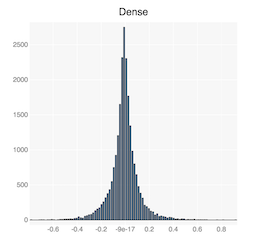
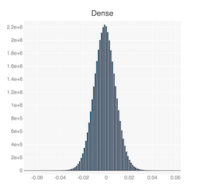
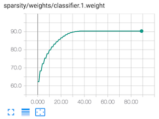
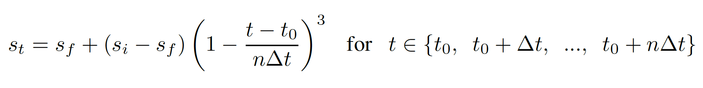
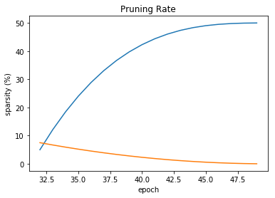
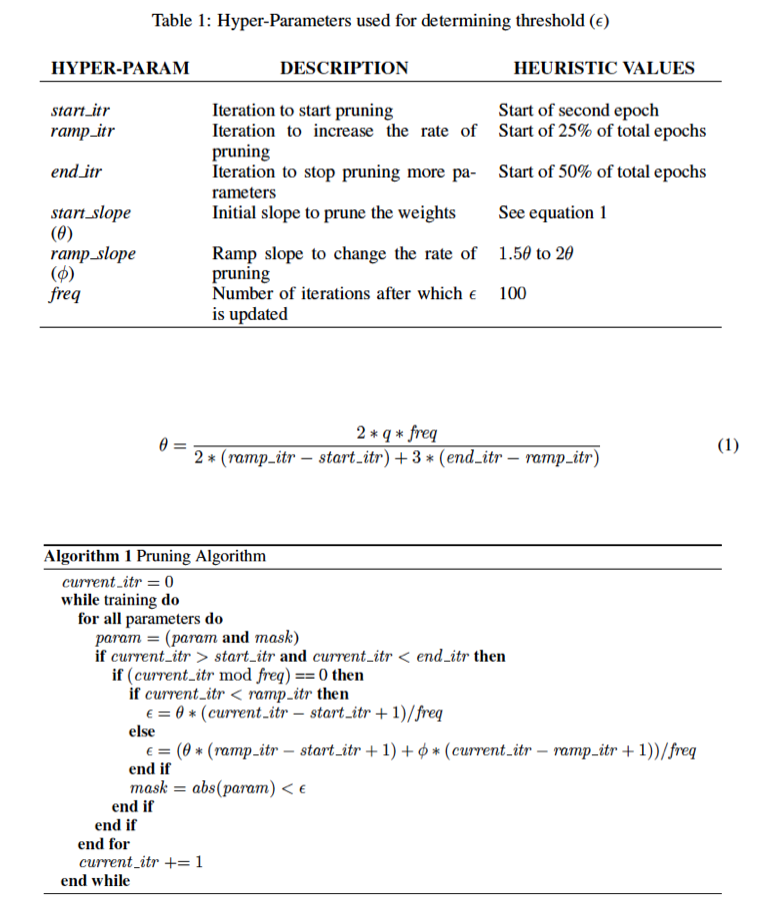

# Weights pruning algorithms

<center></center>

## Magnitude pruner
This is the most basic pruner: it applies a thresholding function, \\(thresh(.)\\), on each element, \\(w_i\\), of a weights tensor.  A different threshold can be used for each layer's weights tensor.<br>
Because the threshold is applied on individual elements, this pruner belongs to the element-wise pruning algorithm family.

\\[ thresh(w_i)=\left\lbrace
\matrix{{{w_i: \; if \;|w_i| \; \gt}\;\lambda}\cr {0: \; if \; |w_i| \leq \lambda} }
\right\rbrace \\]


## Sensitivity pruner
Finding a threshold magnitude per layer is daunting, especially since each layer's elements have different average absolute values.  We can take advantage of the fact that the weights of convolutional and fully connected layers exhibit a Gaussian distribution with a mean value roughly zero, to avoid using a direct threshold based on the values of each specific tensor.
<br>
The diagram below shows the distribution the weights tensor of the first convolutional layer, and first fully-connected layer in TorchVision's pre-trained Alexnet model.  You can see that they have an approximate Gaussian distribution.<br>
<center> </center>
<center>The distributions of Alexnet conv1 and fc1 layers</center>

We use the standard deviation of the weights tensor as a sort of normalizing factor between the different weights tensors.  For example, if a tensor is Normally distributed, then about 68% of the elements have an absolute value less than the standard deviation (\\(\sigma\\)) of the tensor.  Thus, if we set the threshold to \\(s*\sigma\\), then basically we are thresholding \\(s * 68\\%\\) of the tensor elements.  

\\[ thresh(w_i)=\left\lbrace
\matrix{{{w_i: \; if \;|w_i| \; \gt}\;\lambda}\cr {0: \; if \; |w_i| \leq \lambda} }
\right\rbrace \\]

\\[
\lambda = s * \sigma_l \;\;\; where\; \sigma_l\; is \;the \;std \;of \;layer \;l \;as \;measured \;on \;the \;dense \;model
\\]


How do we choose this \\(s\\) multiplier?

In [Learning both Weights and Connections for Efficient Neural Networks](https://arxiv.org/abs/1506.02626) the authors write:
> "We used the sensitivity results to find each layer’s threshold: for example, the smallest threshold was applied to the most sensitive layer, which is the first convolutional layer... The pruning threshold is chosen as a quality parameter multiplied by the standard deviation of a layer’s weights

So the results of executing pruning sensitivity analysis on the tensor, gives us a good starting guess at \\(s\\).  Sensitivity analysis is an empirical method, and we still have to spend time to hone in on the exact multiplier value.

### Method of operation
1. Start by running a pruning sensitivity analysis on the model.  
2. Then use the results to set and tune the threshold of each layer, but instead of using a direct threshold use a sensitivity parameter which is multiplied by the standard-deviation of the initial weight-tensor's distribution.

### Schedule

In their [paper](https://arxiv.org/abs/1506.02626) Song Han et al. use iterative pruning and change the value of the \\(s\\) multiplier at each pruning step.  Distiller's ```SensitivityPruner``` works differently: the value \\(s\\) is set once based on a one-time calculation of the standard-deviation of the tensor (the first time we prune), and relies on the fact that as the tensor is pruned, more elements are "pulled" toward the center of the distribution and thus more elements gets pruned.

This actually works quite well as we can see in the diagram below.  This is a TensorBoard screen-capture from Alexnet training, which shows how this method starts off pruning very aggressively, but then slowly reduces the pruning rate.
<center></center>

We use a simple iterative-pruning schedule such as: *Prune every second epoch starting at epoch 0, and ending at epoch 38.*  This excerpt from ```alexnet.schedule_sensitivity.yaml``` shows how this iterative schedule is conveyed in Distiller scheduling configuration YAML:
```
pruners:
  my_pruner:
    class: 'SensitivityPruner'
    sensitivities:
      'features.module.0.weight': 0.25
      'features.module.3.weight': 0.35
      'features.module.6.weight': 0.40
      'features.module.8.weight': 0.45
      'features.module.10.weight': 0.55
      'classifier.1.weight': 0.875
      'classifier.4.weight': 0.875
      'classifier.6.weight': 0.625

policies:
  - pruner:
      instance_name : 'my_pruner'
    starting_epoch: 0
    ending_epoch: 38
    frequency: 2
```

## Level pruner

Class ```SparsityLevelParameterPruner``` uses a similar method to go around specifying specific thresholding magnitudes.
Instead of specifying a threshold magnitude, you specify a target sparsity level (expressed as a fraction, so 0.5 means 50% sparsity).  Essentially this pruner also uses a pruning criteria based on the magnitude of each tensor element, but it has the advantage that you can aim for an exact and specific sparsity level.<br>  
This pruner is much more stable compared to ```SensitivityPruner``` because the target sparsity level is not coupled to the actual magnitudes of the elements. Distiller's ```SensitivityPruner``` is unstable because the final sparsity level depends on the convergence pattern of the tensor distribution.  Song Han's methodology of using several different values for the multiplier \\(s\\), and the recalculation of the standard-deviation at each pruning phase, probably gives it stability, but requires much more hyper-parameters (this is the reason we have not implemented it thus far).  

To set the target sparsity levels, you can once again use pruning sensitivity analysis to make better guesses at the correct sparsity level of each

### Method of operation

1. Sort the weights in the specified layer by their absolute values. <br>
2. Mask to zero the smallest magnitude weights until the desired sparsity level is reached.


## Automated gradual pruner (AGP)
In [To prune, or not to prune: exploring the efficacy of pruning for model compression](https://arxiv.org/abs/1710.01878), authors Michael Zhu and Suyog Gupta provide an algorithm to schedule a Level Pruner which Distiller implements in ```AutomatedGradualPruner```.
<center></center>
> "We introduce a new automated gradual pruning algorithm in which the sparsity is increased from an initial sparsity value \\(s_i\\) (usually 0) to a final sparsity value \\(s_f\\) over a span of n pruning steps.
The intuition behind this sparsity function in equation (1)  is to prune the network rapidly in the initial phase when the redundant connections are
abundant and gradually reduce the number of weights being pruned each time as there are fewer and fewer weights remaining in the network.""

<center></center>

You can play with the scheduling parameters in the [agp_schedule.ipynb notebook](localhost:8888/notebooks/jupyter/agp_schedule.ipynb).

The authors describe AGP:
>
- Our automated gradual pruning algorithm prunes the smallest magnitude weights to achieve a preset level of network sparsity.
-  Doesn't require much hyper-parameter tuning
- Shown to perform well across different models
- Does not make any assumptions about the structure of the network or its constituent layers, and is therefore more generally applicable.

## RNN pruner
The authors of [Exploring Sparsity in Recurrent Neural Networks](https://arxiv.org/abs/1704.05119), Sharan Narang, Erich Elsen, Gregory Diamos, and Shubho Sengupta, "propose a technique to reduce the parameters of a network by pruning weights during the initial training of the network."  They use a gradual pruning schedule which is reminiscent of the schedule used in AGP, for element-wise pruning of RNNs, which they also employ during training.  They show pruning of RNN, GRU, LSTM and embedding layers.

Distiller's distiller.pruning.BaiduRNNPruner class implements this pruning algorithm.

<center></center>

# Structure pruners
Element-wise pruning can create very sparse models which can be compressed to consume less memory footprint and bandwidth, but without specialized hardware that can compute using the sparse representation of the tensors, we don't gain any speedup of the computation.  Structure pruners, remove entire "structures", such as kernels, filters, and even entire feature-maps.

## Ranked structure pruner
The ```L1RankedStructureParameterPruner``` pruner calculates the magnitude of some "structure", orders all of the structures based on some magnitude function and the *m* lowest ranking structures are pruned away.  Currently this pruner only performs ranking of filters (3D structures) and it uses the mean of the absolute value of the tensor as the representative of the filter magnitude.  The absolute mean does not depend on the size of the filter, so it is easier to use compared to just using the \\(L_1\\)-norm of the structure, and at the same time it is a good proxy of the \\(L_1\\)-norm.

In [Pruning Filters for Efficient ConvNets](https://arxiv.org/abs/1608.08710) the authors use filter ranking, with **one-shot pruning** followed by fine-tuning.  The authors of [Exploiting Sparseness in Deep Neural Networks for Large Vocabulary Speech Recognition](https://ieeexplore.ieee.org/stamp/stamp.jsp?arnumber=6288897) also use a one-shot pruning schedule, for fully-connected layers, and they provide an explanation:
> First, after sweeping through the full training set several times the weights become relatively stable — they tend to remain either large or small magnitudes. Second, in a stabilized model, the importance of the connection is approximated well by the magnitudes of the weights (times the magnitudes of the corresponding input values, but these are relatively uniform within each layer since on the input layer, features are normalized to zero-mean and unit-variance, and hidden-layer values are probabilities)


## Activation-influenced pruner
The motivation for this pruner, is that if a feature-map produces very small activations, then this feature-map is not very important, and can be pruned away.
- <b>Status: not implemented</b><br>
