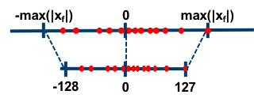
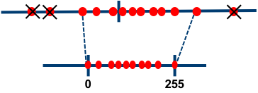

# Quantization Algorithms

**Note:**  
For any of the methods below that require quantization-aware training, please see [here](schedule.md#quantization) for details on how to invoke it using Distiller's scheduling mechanism.

## Range-Based Linear Quantization

Let's break down the terminology we use here:

- **Linear:** Means a float value is quantized by multiplying with a numeric constant (the **scale factor**).
- **Range-Based:** Means that in order to calculate the scale factor, we look at the actual range of the tensor's values. In the most naive implementation, we use the actual min/max values of the tensor. Alternatively, we use some derivation based on the tensor's range / distribution to come up with a narrower min/max range, in order to remove possible outliers. This is in contrast to the other methods described here, which we could call **clipping-based**, as they impose an explicit clipping function on the tensors (using either a hard-coded value or a learned value).

### Asymmetric vs. Symmetric

In this method we can use two modes - **asymmetric** and **symmetric**.

#### Asymmetric Mode

    

In **asymmetric** mode, we map the min/max in the float range to the min/max of the integer range. This is done by using a **zero-point** (also called *quantization bias*, or *offset*) in addition to the scale factor.

Let us denote the original floating-point tensor by \(x_f\), the quantized tensor by \(x_q\), the scale factor by \(q_x\), the zero-point by \(zp_x\) and the number of bits used for quantization by \(n\). Then, we get:

\[x_q = round\left ((x_f - min_{x_f})\underbrace{\frac{2^n - 1}{max_{x_f} - min_{x_f}}}_{q_x} \right) = round(q_x x_f - \underbrace{min_{x_f}q_x)}_{zp_x} = round(q_x x_f - zp_x)\]

In practice, we actually use \(zp_x = round(min_{x_f}q_x)\). This means that zero is exactly representable by an integer in the quantized range. This is important, for example, for layers that have zero-padding. By rounding the zero-point, we effectively "nudge" the min/max values in the float range a little bit, in order to gain this exact quantization of zero.

Note that in the derivation above we use unsigned integer to represent the quantized range. That is, \(x_q \in [0, 2^n-1]\). One could use signed integer if necessary (perhaps due to HW considerations). This can be achieved by subtracting \(2^{n-1}\).

Let's see how a **convolution** or **fully-connected (FC)** layer is quantized in asymmetric mode: (we denote input, output, weights and bias with  \(x, y, w\) and \(b\) respectively)

\[y_f = \sum{x_f w_f} + b_f = \sum{\frac{x_q + zp_x}{q_x} \frac{w_q + zp_w}{q_w}} + \frac{b_q + zp_b}{q_b} =\]
\[ = \frac{1}{q_x q_w} \left( \sum { (x_q + zp_x) (w_q + zp_w) + \frac{q_x q_w}{q_b}(b_q + zp_b) } \right)\]

Therefore:

\[y_q = round(q_y y_f) = round\left(\frac{q_y}{q_x q_w} \left( \sum { (x_q+zp_x) (w_q+zp_w) + \frac{q_x q_w}{q_b}(b_q+zp_b) } \right) \right) \]

Notes:

- We can see that the bias has to be re-scaled to match the scale of the summation.
- In a proper integer-only HW pipeline, we would like our main accumulation term to simply be \(\sum{x_q w_q}\). In order to achieve this, one needs to further develop the expression we derived above. For further details please refer to the [gemmlowp documentation](https://github.com/google/gemmlowp/blob/master/doc/quantization.md#implementation-of-quantized-matrix-multiplication)

#### Symmetric Mode

    

In **symmetric** mode, instead of mapping the exact min/max of the float range to the quantized range, we choose the maximum absolute value between min/max. In addition, we don't use a zero-point. So, the floating-point range we're effectively quantizing is symmetric with respect to zero, and so is the quantized range.

There's a nuance in the symmetric case with regards to the quantized range. Assuming \(N_{bins}=2^n-1\), we can use either a "full" or "restricted" quantized range:

| | Full Range | Restricted Range|
|-|------|----------|
| Quantized Range | \(\left[-\frac{N_{bins}}{2}, \frac{N_{bins}}{2} - 1\right]\) | \(\left[-\left(\frac{N_{bins}}{2} - 1\right), \frac{N_{bins}}{2} - 1\right]\) |
| 8-bit example   | \([-128, 127]\)   (As shown in image above)               | \([-127,127]\) |
| Scale Factor    | \(q_x = \frac{(2^n-1)/2}{\max(abs(x_f))}\)                  | \( q_x = \frac{2^{n-1}-1}{\max(abs(x_f))}\) |

The restricted range is less accurate on-paper, and is usually used when specific HW considerations require it. Implementations of quantization "in the wild" that use a full range include PyTorch's native quantization (from v1.3 onwards) and ONNX. Implementations that use a restricted range include TensorFlow, NVIDIA TensorRT and Intel DNNL (aka MKL-DNN). Distiller can emulate both modes.

Using the same notations as above, we get (regardless of full/restricted range):

\[x_q = round(q_x x_f)\]

Again, let's see how a **convolution** or **fully-connected (FC)** layer is quantized, this time in symmetric mode:

\[y_f = \sum{x_f w_f} + b_f = \sum{\frac{x_q}{q_x} \frac{w_q}{q_w}} + \frac{b_q}{q_b} = \frac{1}{q_x q_w} \left( \sum { x_q w_q + \frac{q_x q_w}{q_b}b_q } \right)\]

Therefore:

\[y_q = round(q_y y_f) = round\left(\frac{q_y}{q_x q_w} \left( \sum { x_q w_q + \frac{q_x q_w}{q_b}b_q } \right) \right) \]

#### Comparing the Two Modes

The main trade-off between these two modes is simplicity vs. utilization of the quantized range.

- When using asymmetric quantization, the quantized range is fully utilized. That is because we exactly map the min/max values from the float range to the min/max of the quantized range. Using symmetric mode, if the float range is biased towards one side, could result in a quantized range where significant dynamic range is dedicated to values that we'll never see. The most extreme example of this is after ReLU, where the entire tensor is positive. Quantizing it in symmetric mode means we're effectively losing 1 bit.
- On the other hand, if we look at the derviations for convolution / FC layers above, we can see that the actual implementation of symmetric mode is much simpler. In asymmetric mode, the zero-points require additional logic in HW. The cost of this extra logic in terms of latency and/or power and/or area will of course depend on the exact implementation.

### Other Features

- **Scale factor scope:** For weight tensors, Distiller supports per-channel quantization (per output channel).
- **Removing outliers (post-training only):** As discussed [here](quantization.md#outliers-removal), in some cases the float range of activations contains outliers. Spending dynamic range on these outliers hurts our ability to represent the values we actually care about accurately.
   

       
   

  Currently, Distiller supports clipping of activations during post-training quantization using the following methods:
  
    - Averaging: Global min/max values are replaced with an average of the min/max values of each sample in the batch.
    - Mean +/- N*Std: Take N standard deviations for the tensor's mean, and in any case don't exceed the tensor's actual min/max. N is user configurable.
    - ACIQ - Analytical calculation of clipping values assuming either a Gaussian or Laplace distribution. As proposed in [Post training 4-bit quantization of convolutional
networks for rapid-deployment](https://arxiv.org/abs/1810.05723).

- **Scale factor approximation (post-training only):** This can be enabled optionally, to simulate an execution pipeline with no floating-point operations. Instead of multiplying with a floating-point scale factor, we multiply with an integer and then do a bit-wise shift: \(Q \approx {A}/{2^n}\), where \(Q\) denotes the FP32 scale factor, \(A\) denotes the integer multiplier and \(n\) denotes the number of bits by which we shift after multiplication. The number of bits assigned to \(A\) is usually a parameter of the HW, and in Distiller it is configured by the user. Let us denote that with \(m\). Given \(Q\) and \(m\), we determine \(A\) and \(n\) as follows:

\[Q \approx \frac{A}{2^n} \Rightarrow A \approx 2^nQ \Rightarrow\]
\[\Rightarrow 2^nQ \le 2^m - 1 \Rightarrow\]
\[\Rightarrow n = \left\lfloor\log_2\frac{2^m - 1}{Q}\right\rfloor\ \ \ ;\ \ \ A = \lfloor 2^nQ \rfloor\]

### Implementation in Distiller

#### Post-Training

For post-training quantization, this method is implemented by wrapping existing modules with quantization and de-quantization operations. The wrapper implementations are in [`range_linear.py`](https://github.com/IntelLabs/distiller/blob/master/distiller/quantization/range_linear.py).

- The following operations have dedicated implementations which consider quantization:
    - `torch.nn.Conv2d/Conv3d`
    - `torch.nn.Linear`
    - `torch.nn.Embedding`
    - `distiller.modules.Concat`
    - `distiller.modules.EltwiseAdd`
    - `distiller.modules.EltwiseMult`
    - `distiller.modules.Matmul`
    - `distiller.modules.BatchMatmul`
- Any existing module will likely need to be modified to use the `distiller.modules.*` modules. See [here](prepare_model_quant.md) for details on how to prepare a model for quantization.
- To automatically transform an existing model to a quantized model using this method, use the `PostTrainLinearQuantizer` class. For details on ways to invoke the quantizer see [here](schedule.md#post-training-quantization).
- When using `PostTrainLinearQuantizer`, by default, any operation not in the list above is "fake"-quantized, meaning it is executed in FP32 and its output is quantized. Quantization for specific layers (or groups of layers) can be disabled using Distiller's override mechanism (see example [here](https://github.com/IntelLabs/distiller/blob/master/examples/quantization/post_train_quant/resnet18_imagenet_post_train.yaml)).
- For weights and bias the scale factor and zero-point are determined once at quantization setup ("offline" / "static"). For activations, both "static" and "dynamic" quantization is supported. Static quantization of activations requires that statistics be collected beforehand. See details on how to do that [here](schedule.md#collecting-statistics-for-quantization).
- The calculated quantization parameters are stored as buffers within the module, so they are automatically serialized when the model checkpoint is saved.

#### Quantization-Aware Training

To apply range-based linear quantization in training, use the `QuantAwareTrainRangeLinearQuantizer` class. As it is now, it will apply weights quantization to convolution, FC and embedding modules. For activations quantization, it will insert instances `FakeLinearQuantization` module after ReLUs. This module follows the methodology described in [Benoit et al., 2018](http://openaccess.thecvf.com/content_cvpr_2018/html/Jacob_Quantization_and_Training_CVPR_2018_paper.html) and uses exponential moving averages to track activation ranges.  
Note that the current implementation of `QuantAwareTrainRangeLinearQuantizer` supports training with **single GPU only**.

Similarly to post-training, the calculated quantization parameters (scale factors, zero-points, tracked activation ranges) are stored as buffers within their respective modules, so they're saved when a checkpoint is created.

Note that converting from a quantization-aware training model to a post-training quantization model is not yet supported. Such a conversion will use the activation ranges tracked during training, so additional offline or online calculation of quantization parameters will not be required.

## DoReFa

(As proposed in [DoReFa-Net: Training Low Bitwidth Convolutional Neural Networks with Low Bitwidth Gradients](https://arxiv.org/abs/1606.06160))  
  
In this method, we first define the quantization function \(quantize_k\), which takes a real value \(a_f \in [0, 1]\) and outputs a discrete-valued \(a_q \in \left\{ \frac{0}{2^k-1}, \frac{1}{2^k-1}, ... , \frac{2^k-1}{2^k-1} \right\}\), where \(k\) is the number of bits used for quantization.

\[a_q = quantize_k(a_f) = \frac{1}{2^k-1} round \left( \left(2^k - 1 \right) a_f \right)\]

Activations are clipped to the \([0, 1]\) range and then quantized as follows:

\[x_q = quantize_k(x_f)\]

For weights, we define the following function \(f\), which takes an unbounded real valued input and outputs a real value in \([0, 1]\):

\[f(w) = \frac{tanh(w)}{2 max(|tanh(w)|)} + \frac{1}{2} \]

Now we can use \(quantize_k\) to get quantized weight values, as follows:

\[w_q = 2 quantize_k \left( f(w_f) \right) - 1\]

This method requires training the model with quantization-aware training, as discussed [here](quantization.md#quantization-aware-training). Use the `DorefaQuantizer` class to transform an existing model to a model suitable for training with quantization using DoReFa.

### Notes

- Gradients quantization as proposed in the paper is not supported yet.
- The paper defines special handling for binary weights which isn't supported in Distiller yet.

## PACT

(As proposed in [PACT: Parameterized Clipping Activation for Quantized Neural Networks](https://arxiv.org/abs/1805.06085))

This method is similar to DoReFa, but the upper clipping values, \(\alpha\), of the activation functions are learned parameters instead of hard coded to 1. Note that per the paper's recommendation, \(\alpha\) is shared per layer.

This method requires training the model with quantization-aware training, as discussed [here](quantization.md#quantization-aware-training). Use the `PACTQuantizer` class to transform an existing model to a model suitable for training with quantization using PACT.

## WRPN

(As proposed in [WRPN: Wide Reduced-Precision Networks](https://arxiv.org/abs/1709.01134))  

In this method, activations are clipped to \([0, 1]\) and quantized as follows (\(k\) is the number of bits used for quantization):

\[x_q = \frac{1}{2^k-1} round \left( \left(2^k - 1 \right) x_f \right)\]

Weights are clipped to \([-1, 1]\) and quantized as follows:

\[w_q = \frac{1}{2^{k-1}-1} round \left( \left(2^{k-1} - 1 \right)w_f \right)\]

Note that \(k-1\) bits are used to quantize weights, leaving one bit for sign.

This method requires training the model with quantization-aware training, as discussed [here](quantization.md#quantization-aware-training). Use the `WRPNQuantizer` class to transform an existing model to a model suitable for training with quantization using WRPN.

### Notes

- The paper proposed widening of layers as a means to reduce accuracy loss. This isn't implemented as part of `WRPNQuantizer` at the moment. To experiment with this, modify your model implementation to have wider layers.
- The paper defines special handling for binary weights which isn't supported in Distiller yet.
