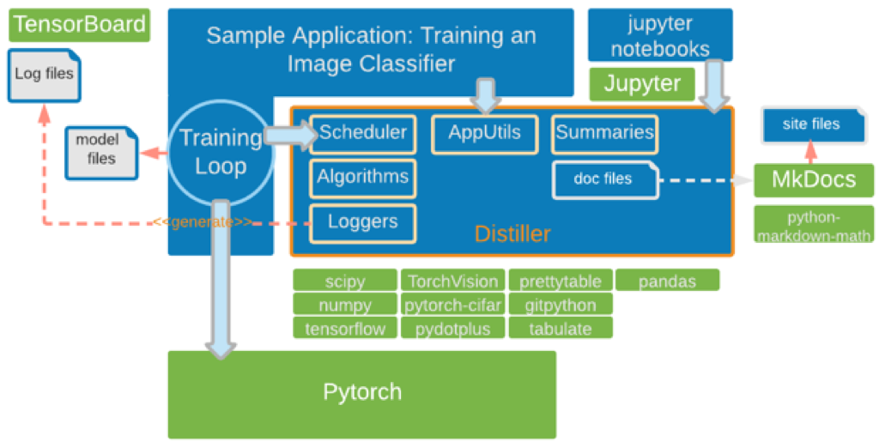

# Distiller design

Distiller is designed to be easily integrated into your own PyTorch research applications.<br>
It is easiest to understand this integration by examining the code of the sample application for compressing image classification models (```compress_classifier.py```).<br>

The application borrows its main flow code from torchvision's ImageNet classification training sample application (https://github.com/pytorch/examples/tree/master/imagenet). We tried to keep it similar, in order to make it familiar and easy to understand.

Integrating compression is very simple: simply add invocations of the appropriate compression_scheduler callbacks, for each stage in the training.  The training skeleton looks like the pseudo code below.  The boiler-plate Pytorch classification training is speckled with invocations of CompressionScheduler.

```
For each epoch:
    compression_scheduler.on_epoch_begin(epoch)
    train()
    validate()
    save_checkpoint()
    compression_scheduler.on_epoch_end(epoch)

train():
    For each training step:
        compression_scheduler.on_minibatch_begin(epoch)
        output = model(input_var)
        loss = criterion(output, target_var)
        compression_scheduler.before_backward_pass(epoch)
        loss.backward()
        optimizer.step()
        compression_scheduler.on_minibatch_end(epoch)
```

These callbacks can be seen in the diagram below, as the arrow pointing from the Training Loop and into Distiller's *Scheduler*, which invokes the correct algorithm.  The application also uses Distiller services to collect statistics in *Summaries* and logs files, which can be queried at a later time, from Jupyter notebooks or TensorBoard.

<center></center><br>

## Sparsification and fine-tuning
- The application sets up a model as normally done in PyTorch.
- And then instantiates a Scheduler and configures it:
    * Scheduler configuration is defined in a YAML file
    * The configuration specifies Policies. Each Policy is tied to a specific algorithm which controls some aspect of the training.
        * Some types of algorithms control the actual sparsification of the model. Such types are "pruner" and "regularizer".
        * Some algorithms control some parameter of the training process, such as the learning-rate decay scheduler (*lr_scheduler*).
        * The parameters of each algorithm are also specified in the configuration.
- In addition to specifying the algorithm, each Policy specifies scheduling parameters which control when the algorithm is executed: start epoch, end epoch and frequency.
- The Scheduler exposes callbacks for relevant training stages: epoch start/end, mini-batch start/end and pre-backward pass. Each scheduler callback activates the policies that were defined according the schedule that was defined.
- These callbacks are placed the training loop.

## Quantization
A quantized model is obtained by replacing existing operations with quantized versions. The quantized versions can be either complete replacements, or wrappers. A wrapper will use the existing modules internally and add quantization and de-quantization operations before/after as necessary.

In Distiller we will provide a set of quantized versions of common operations which will enable implementation of different quantization methods. The user can write a quantized model from scratch, using the quantized operations provided.

We also provide a mechanism which takes an existing model and automatically replaces required operations with quantized versions. The high-level flow is as follows:

- Define a **mapping** between the module types to be replaced (e.g. Conv2D, Linear, etc.) to a function which generates the replacement module.
- Iterate over the modules defined in the model. For each module, if its type is in the mapping, call the replacement generation function. We pass the existing module to this function to allow wrapping of it.
- Replace the existing module with the module returned by the function.

Different quantization methods may, obviously, use different quantized operations. In addition, different methods may employ different "strategies" of replacing / wrapping existing modules. For instance, some methods replace ReLU with another activation function, while others keep it. Hence, for each quantization method, a different **mapping** will likely be defined.

This mechanism is exposed by the `Quantizer` class:

- `Quantizer` should be sub-classed for each quantization method.
- Each instance of `Quantizer` is parameterized by the number of bits to be used for quantization of different tensor types. The default ones are activations and weights. These are the `bits_activations` and `bits_weights` parameters in `Quantizer`'s constructor. Sub-classes may define bit-widths for other tensor types as needed.
- We also want to be able to override the default number of bits mentioned in the bullet above for certain layers. These could be very specific layers. However, many models are comprised of building blocks ("container" modules, such as Sequential) which contain several modules, and it is likely we'll want to override settings for entire blocks, or for a certain module across different blocks. When such building blocks are used, the names of the internal modules usually follow some pattern.
   - So, for this purpose, Quantizer also accepts a mapping of regular expressions to number of bits. This allows the user to override specific layers using they're exact name, or a group of layers via a regular expression. This mapping is passed via the `bits_overrides` parameter in the constructor.

The base `Quantizer` class is implemented in `distiller/quantization/quantizer.py`.  
For a simple sub-class implementing symmetric linear quantization, see `SymmetricLinearQuantizer` in `distiller/quantization/range_linear.py`.
