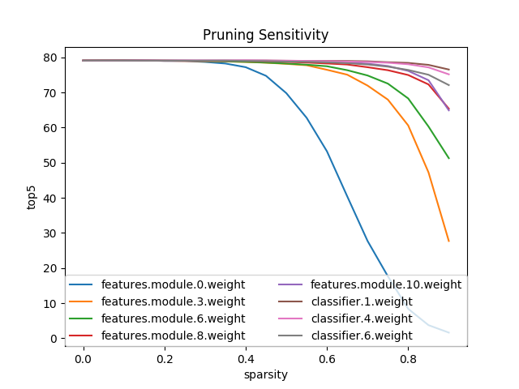

# Pruning
A common methodology for inducing sparsity in weights and activations is called *pruning*.  Pruning is the application of a binary criteria to decide which weights to prune: weights which match the pruning criteria are assigned a value of zero.  Pruned elements are "trimmed" from the model: we zero their values and also make sure they don't take part in the back-propagation process.

We can prune weights, biases, and activations.  Biases are few and their contribution to a layer's output is relatively large, so there is little incentive to prune them.  We usually see sparse activations following a ReLU layer, because ReLU quenches negative activations to exact zero (\\(ReLU(x): max(0,x)\\)).   Sparsity in weights is less common, as weights tend to be very small, but are often not exact zeros.
<br>

## Let's define sparsity
Sparsity is a a measure of how many elements in a tensor are exact zeros, relative to the tensor size.  A tensor is considered sparse if "most" of its elements are zero.  How much is "most", is not strictly defined, but when you see a sparse tensor you know it ;-)<br>
The [\\(l_0\\)-"norm" function](https://en.wikipedia.org/wiki/Lp_space#When_p_=_0) measures how many zero-elements are in a tensor *x*:
\\[\lVert x \rVert_0\;=\;|x_1|^0 + |x_2|^0 + ... + |x_n|^0 \\]
In other words, an element contributes either a value of 1 or 0 to \\(l_0\\).  Anything but an exact zero contributes a value of 1 - that's pretty cool.  
Sometimes it helps to think about density, the number of non-zero elements (NNZ) and sparsity's complement:
\\[
density = 1 - sparsity
\\]
You can use ```distiller.sparsity``` and ```distiller.density``` to query a PyTorch tensor's sparsity and density.

## What is weights pruning?
Weights pruning, or model pruning, is a set of methods to increase the sparsity (amount of zero-valued elements in a tensor) of a network's weights.  In general, the term 'parameters' refers to both weights and bias tensors of a model.  Biases are rarely, if ever, pruned because there are very few bias elements compared to weights elements, and it is just not worth the trouble.
<br><br>
Pruning requires a criteria for choosing which elements to prune - this is called the *pruning criteria*.  The most common pruning criteria is the absolute value of each element: the element's absolute value is compared to some threshold value, and if it is below the threshold the element is set to zero (i.e. pruned) .  This is implemented by the ```distiller.MagnitudeParameterPruner``` class.  The idea behind this method, is that weights with small \\(l_1\\)-norms (absolute value) contribute little to the final result (low saliency), so they are less important and can be removed.
<br>
A related idea motivating pruning, is that models are over-parametrized and contain redundant logic and features.  Therefore, some of these redundancies can be removed by setting their weights to zero.
<br>
And yet another way to think of pruning is to phrase it as a search for a set of weights with as many zeros as possible, which still produces acceptable inference accuracies compared to the dense-model (non-pruned model).  Another way to look at it, is to imagine that because of the very high-dimensionality of the parameter space, the immediate space around the dense-model's solution likely contains some sparse solutions, and we want to use find these sparse solutions.   
<br>
## Pruning schedule
The most straight-forward to prune is to take a trained model and prune it once; also called *one-shot pruning*.  In [Learning both Weights and Connections for Efficient Neural Networks](#han-et-al-2015) Song Han et. al show that this is surprisingly effective, but also leaves a lot of potential sparsity untapped.  The surprise is what they call the "free lunch" effect: *"reducing 2x the connections without losing accuracy even without retraining."*<br>
However, they also note that when employing a pruning-followed-by-retraining regimen, they can achieve much better results (higher sparsity at no accuracy loss).  This is called *iterative pruning*, and the retraining that follows pruning is often referred to as *fine-tuning*. How the pruning criteria changes between iterations, how many iterations we perform and how often, and which tensors are pruned - this is collectively called the *pruning schedule*.
<br>
We can think of iterative pruning as repeatedly learning which weights are important, removing the least important ones based on some importance criteria, and then retraining the model to let it "recover" from the pruning by adjusting the remaining weights.  At each iteration, we prune more weights.<br>
The decision of when to stop pruning is also expressed in the schedule, and it depends on the pruning algorithm.  For example, if we are trying to achieve a specific sparsity level, then we stop when the pruning achieves that level.  And if we are pruning weights structures in order to reduce the required compute budget, then we stop the pruning when this compute reduction is achieved.
<br><br>
Distiller supports expressing the pruning schedule as a YAML file (which is then executed by an instance of a PruningScheduler).

## Pruning granularity
Pruning individual weight elements is called *element-wise pruning*, and it is also sometimes referred to as *fine-grained* pruning.<br>
*Coarse-grained pruning* - also referred to as *structured pruning*, *group pruning*, or *block pruning* - is pruning entire groups of elements which have some significance.  Groups come in various shapes and sizes, but an easy to visualize group-pruning is filter-pruning, in which entire filters are removed.

## Sensitivity analysis
The hard part about inducing sparsity via pruning is determining what threshold, or sparsity level, to use for each layer's tensors.  Sensitivity analysis is a method that tries to help us rank the tensors by their sensitivity to pruning.  <br><br>
The idea is to set the pruning level (percentage) of a specific layer, and then to prune once, run an evaluation on the test dataset and record the accuracy score.  We do this for all of the parameterized layers, and for each layer we examine several sparsity levels.  This should teach us about the "sensitivity" of each of the layers to pruning.
<br>
The evaluated model should be trained to maximum accuracy before running the analysis, because we aim to understand the behavior of the trained model's performance in relation to pruning of a specific weights tensor.
<br>
Much as we can prune structures, we can also perform sensitivity analysis on structures.  Distiller implements element-wise pruning sensitivity analysis using the \\(l_1\\)-norm of individual elements; and filter-wise pruning sensitivity analysis using the mean \\(l_1\\)-norm of filters.
<br>

The authors of [Pruning Filters for Efficient ConvNets](#hao-et-al-2017) describe how they do sensitivity analysis:
>"To understand the sensitivity of each layer, we prune each layer independently and evaluate the resulting pruned network’s accuracy on the validation set. Figure 2(b) shows that layers that maintain their accuracy as filters are pruned away correspond to layers with larger slopes in Figure 2(a). On the contrary, layers with relatively flat slopes are more sensitive to pruning. We empirically determine the number of filters to prune for each layer based on their sensitivity to pruning. For deep networks such as VGG-16 or ResNets, we observe that layers in the same stage (with the same feature map size) have a similar sensitivity to pruning. To avoid introducing layer-wise meta-parameters, we use the same pruning ratio for all layers in the same stage. For layers that are sensitive to pruning, we prune a smaller percentage of these layers or completely skip pruning them."


The diagram below shows the results of running an element-wise sensitivity analysis on Alexnet, using Distillers's ```perform_sensitivity_analysis``` utility function.
<br>
As reported by Song Han, and exhibited in the diagram, in Alexnet the feature detecting layers (convolution layers) are more sensitive to pruning, and their sensitivity drops, the deeper they are.  The fully-connected layers are much less sensitive, which is great, because that's where most of the parameters are.

<center></center><br>

## References
<div id="han-et-al-2015"></div> **Song Han, Jeff Pool, John Tran, William J. Dally**.
    [*Learning both Weights and Connections for Efficient Neural Networks*](https://arxiv.org/abs/1506.02626),
     arXiv:1607.04381v2,
    2015.

<div id="hao-et-al-2017"></div> **Hao Li, Asim Kadav, Igor Durdanovic, Hanan Samet, Hans Peter Graf**.
    [*Pruning Filters for Efficient ConvNets*](https://arxiv.org/abs/1608.08710),
     arXiv:1608.08710v3,
    2017.
