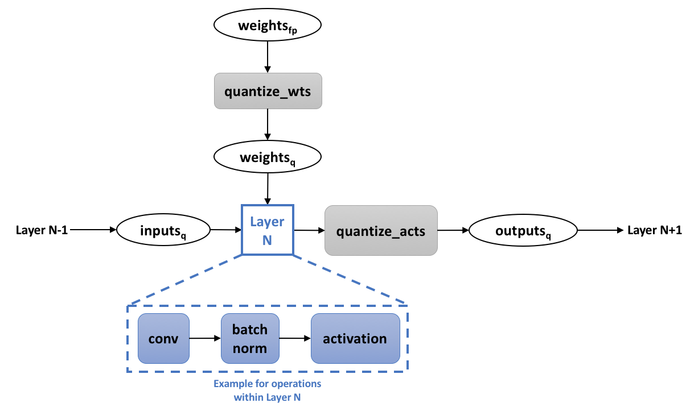

# Quantization

Quantization refers to the process of reducing the number of bits that represent a number. In the context of deep learning, the predominant numerical format used for research and for deployment has so far been 32-bit floating point, or FP32. However, the desire for reduced bandwidth and compute requirements of deep learning models has driven research into using lower-precision numerical formats. It has been extensively demonstrated that weights and activations can be represented using 8-bit integers (or INT8) without incurring significant loss in accuracy. The use of even lower bit-widths, such as 4/2/1-bits, is an active field of research that has also shown great progress.

Note that this discussion is on quantization only in the context of more efficient inference. Using lower-precision numerics for more efficient training is currently out of scope.

## Motivation: Overall Efficiency

The more obvious benefit from quantization is **significantly reduced bandwidth and storage**. For instance, using INT8 for weights and activations consumes 4x less overall bandwidth compared to FP32.  
Additionally integer compute is **faster** than floating point compute. It is also much more **area and energy efficient**: 

| INT8 Operation | Energy Saving vs FP32 | Area Saving vs FP32 |
|----------------|-----------------------|---------------------|
| Add            | 30x                   | 116x                |
| Multiply       | 18.5x                 | 27x                 |

([Dally, 2015](#dally-2015))

Note that very aggressive quantization can yield even more efficiency. If weights are binary (-1, 1) or ternary (-1, 0, 1 using 2-bits), then convolution and fully-connected layers can be computed with additions and subtractions only, removing multiplications completely. If activations are binary as well, then additions can also be removed, in favor of bitwise operations ([Rastegari et al., 2016](#rastegari-et-al-2016)).

## Integer vs. FP32

There are two main attributes when discussing a numerical format. The first is **dynamic range**, which refers to the range of representable numbers. The second one is how many values can be represented within the dynamic range, which in turn determines the **precision / resolution** of the format (the distance between two numbers).  
For all integer formats, the dynamic range is \([-2^{n-1} .. 2^{n-1}-1]\), where \(n\) is the number of bits. So for INT8 the range is \([-128 .. 127]\), and for INT4 it is \([-16 .. 15]\) (we're limiting ourselves to signed integers for now). The number of representable values is \(2^n\).
Contrast that with FP32, where the dynamic range is \(\pm 3.4\ x\ 10^{38}\), and approximately \(4.2\ x\ 10^9\) values can be represented.  
We can immediately see that FP32 is much more **versatile**, in that it is able to represent a wide range of distributions accurately. This is a nice property for deep learning models, where the distributions of weights and activations are usually very different (at least in dynamic range). In addition the dynamic range can differ between layers in the model.  
In order to be able to represent these different distributions with an integer format, a **scale factor** is used to map the dynamic range of the tensor to the integer format range. But still we remain with the issue of having a significantly lower number of representable values, that is - much lower resolution.  
Note that this scale factor is, in most cases, a floating-point number. Hence, even when using integer numerics, some floating-point computations remain. [Courbariaux et al., 2014](#courbariaux-et-al-2014) scale using only shifts, eliminating the floating point operation. In [GEMMLWOP](https://github.com/google/gemmlowp/blob/master/doc/quantization.md), the FP32 scale factor is approximated using an integer or fixed-point multiplication followed by a shift operation. In many cases the effect of this approximation on accuracy is negligible.

### Avoiding Overflows

Convolution and fully connected layers involve the storing of intermediate results in accumulators. Due to the limited dynamic range of integer formats, if we would use the same bit-width for the weights and activation, *and* for the accumulators, we would likely overflow very quickly. Therefore, accumulators are usually implemented with higher bit-widths.  
The result of multiplying two \(n\)-bit integers is, at most, a \(2n\)-bit number. In convolution layers, such multiplications are accumulated \(c\cdot k^2\) times, where \(c\) is the number of input channels and \(k\) is the kernel width (assuming a square kernel). Hence, to avoid overflowing, the accumulator should be \(2n + M\)-bits wide, where M is at least \(log_2(c\cdot k^2)\). In many cases 32-bit accumulators are used, however for INT4 and lower it might be possible to use less than 32 -bits, depending on the expected use cases and layer widths.

## "Conservative" Quantization: INT8

In many cases, taking a model trained for FP32 and directly quantizing it to INT8, without any re-training, can result in a relatively low loss of accuracy (which may or may not be acceptable, depending on the use case). Some fine-tuning can further improve the accuracy ([Gysel at al., 2018](#gysel-et-al-2018)).  
As mentioned above, a scale factor is used to adapt the dynamic range of the tensor at hand to that of the integer format. This scale factor needs to be calculated per-layer per-tensor. The simplest way is to map the min/max values of the float tensor to the min/max of the integer format. For weights and biases this is easy, as they are set once training is complete. For activations, the min/max float values can be obtained "online" during inference, or "offline".

- **Offline** means gathering activations statistics before deploying the model, either during training or by running a few "calibration" batches on the trained FP32 model. Based on these gathered statistics, the scaled factors are calculated and are fixed once the model is deployed. This method has the risk of encountering values outside the previously observed ranges at runtime. These values will be clipped, which might lead to accuracy degradation.
- **Online** means calculating the min/max values for each tensor dynamically during runtime. In this method clipping cannot occur, however the added computation resources required to calculate the min/max values at runtime might be prohibitive.

It is important to note, however, that the full float range of an activations tensor usually includes elements which are statistically outliers. These values can be discarded by using a narrower min/max range, effectively allowing some clipping to occur in favor of increasing the resolution provided to the part of the distribution containing most of the information. Statistical measures can be used to intelligently select where to clip the original range in order to preserve as much information as possible ([Migacz, 2017](#migacz-2017)).  

Another possible optimization point is **scale-factor scope**. The most common way is use a single scale-factor per-layer, but it is also possible to calculate a scale-factor per-channel. This can be beneficial if the weight distributions vary greatly between channels.

## "Aggressive" Quantization: INT4 and Lower

Naively quantizing a FP32 model to INT4 and lower usually incurs significant accuracy degradation. Many works have tried to mitigate this effect. They usually employ one or more of the following concepts in order to improve model accuracy:

- **Training / Re-Training**: For INT4 and lower, training is required in order to obtain reasonable accuracy. The training loop is modified to take quantization into account. See details in the [next section](#training-with-quantization).  
[Zhou S et al., 2016](#zhou-et-al-2016) have shown that bootstrapping the quantized model with trained FP32 weights leads to higher accuracy, as opposed to training from scratch. Other methods *require* a trained FP32 model, either as a starting point ([Zhou A et al., 2017](#zhou-et-al-2017)), or as a teacher network in a knowledge distillation training setup (see [here](knowledge_distillation.md#combining)).
- **Replacing the activation function**: The most common activation function in vision models is ReLU, which is unbounded. That is - its dynamic range is not limited for positive inputs. This is very problematic for INT4 and below due to the very limited range and resolution. Therefore, most methods replace ReLU with another function which is bounded. In some cases a clipping function with hard coded values is used ([Zhou S et al., 2016](#zhou-et-al-2016), [Mishra et al., 2018](#mishra-et-al-2018)). Another method learns the clipping value per layer, with better results ([Choi et al., 2018](#choi-et-al-2018)). Once the clipping value is set, the scale factor used for quantization is also set, and no further calibration steps are required (as opposed to INT8 methods described above).
- **Modifying network structure**: [Mishra et al., 2018](#mishra-et-al-2018) try to compensate for the loss of information due to quantization by using wider layers (more channels). [Lin et al., 2017](#lin-et-al-2017) proposed a binary quantization method in which a single FP32 convolution is replaced with multiple binary convolutions, each scaled to represent a different "base", covering a larger dynamic range overall.
- **First and last layer**: Many methods do not quantize the first and last layer of the model. It has been observed by [Han et al., 2015](#han-et-al-2015) that the first convolutional layer is more sensitive to weights pruning, and some quantization works cite the same reason and show it empirically ([Zhou S et al., 2016](#zhou-et-al-2016), [Choi et al., 2018](#choi-et-al-2018)). Some works also note that these layers usually constitute a very small portion of the overall computation within the model, further reducing the motivation to quantize them ([Rastegari et al., 2016](#rastegari-et-al-2016)). Most methods keep the first and last layers at FP32. However, [Choi et al., 2018](#choi-et-al-2018) showed that "conservative" quantization of these layers, e.g. to INT8, does not reduce accuracy.
- **Iterative quantization**: Most methods quantize the entire model at once. [Zhou A et al., 2017](#zhou-et-al-2017) employ an iterative method, which starts with a trained FP32 baseline, and quantizes only a portion of the model at the time followed by several epochs of re-training to recover the accuracy loss from quantization.
- **Mixed Weights and Activations Precision**: It has been observed that activations are more sensitive to quantization than weights ([Zhou S et al., 2016](#zhou-et-al-2016)). Hence it is not uncommon to see experiments with activations quantized to a higher precision compared to weights. Some works have focused solely on quantizing weights, keeping the activations at FP32 ([Li et al., 2016](#li-et-al-2016), [Zhu et al., 2016](#zhu-et-al-2016)).

## Training with Quantization

As mentioned above, in order to minimize the loss of accuracy from "aggressive" quantization, many methods that target INT4 and lower involve training the model in a way that considers the quantization. This means training with quantization of weights and activations "baked" into the training procedure. The training graph usually looks like this:

A full precision copy of the weights is maintained throughout the training process ("weights_fp" in the diagram). Its purpose is to accumulate the small changes from the gradients without loss of precision (Note that the quantization of the weights is an integral part of the training graph, meaning that we back-propagate through it as well). Once the model is trained, only the quantized weights are used for inference.  
In the diagram we show "layer N" as the conv + batch-norm + activation combination, but the same applies to fully-connected layers, element-wise operations, etc. During training, the operations within "layer N" can still run in full precision, with the "quantize" operations in the boundaries ensuring discrete-valued weights and activations. This is sometimes called "simulated quantization".  

### Straight-Through Estimator
An important question in this context is how to back-propagate through the quantization functions. These functions are discrete-valued, hence their derivative is 0 almost everywhere. So, using their gradients as-is would severly hinder the learning process. An approximation commonly used to overcome this issue is the "straight-through estimator" (STE) ([Hinton et al., 2012](#hinton-et-al-2012), [Bengio, 2013](#bengio-et-al-2013)), which simply passes the gradient through these functions as-is.  

## References

**William Dally**. High-Performance Hardware for Machine Learning. [Tutorial, NIPS, 2015](https://media.nips.cc/Conferences/2015/tutorialslides/Dally-NIPS-Tutorial-2015.pdf)

**Mohammad Rastegari, Vicente Ordone, Joseph Redmon and Ali Farhadi**. XNOR-Net: ImageNet Classification Using Binary Convolutional Neural Networks. [ECCV, 2016](https://link.springer.com/chapter/10.1007%2F978-3-319-46493-0_32)

**Matthieu Courbariaux, Yoshua Bengio and Jean-Pierre David**. Training deep neural networks with low precision multiplications. [arxiv:1412.7024](https://arxiv.org/abs/1412.7024)

**Philipp Gysel, Jon Pimentel, Mohammad Motamedi and Soheil Ghiasi**. Ristretto: A Framework for Empirical Study of Resource-Efficient Inference in Convolutional Neural Networks. [IEEE Transactions on Neural Networks and Learning Systems, 2018](http://ieeexplore.ieee.org/document/8318896/)

**Szymon Migacz**. 8-bit Inference with TensorRT. [GTC San Jose, 2017](http://on-demand.gputechconf.com/gtc/2017/presentation/s7310-8-bit-inference-with-tensorrt.pdf)

**Shuchang Zhou, Zekun Ni, Xinyu Zhou, He Wen, Yuxin Wu and Yuheng Zou**. DoReFa-Net: Training Low Bitwidth Convolutional Neural Networks with Low Bitwidth Gradients. [arxiv:1606.06160](https://arxiv.org/abs/1606.06160)

**Aojun Zhou, Anbang Yao, Yiwen Guo, Lin Xu and Yurong Chen**. Incremental Network Quantization: Towards Lossless CNNs with Low-precision Weights. [ICLR, 2017](https://arxiv.org/abs/1702.03044)

**Asit Mishra, Eriko Nurvitadhi, Jeffrey J Cook and Debbie Marr**. WRPN: Wide Reduced-Precision Networks. [ICLR, 2018](https://openreview.net/forum?id=B1ZvaaeAZ)

**Jungwook Choi, Zhuo Wang, Swagath Venkataramani, Pierce I-Jen Chuang, Vijayalakshmi Srinivasan and Kailash Gopalakrishnan**. PACT: Parameterized Clipping Activation for Quantized Neural Networks. [2018](https://openreview.net/forum?id=By5ugjyCb)

**Xiaofan Lin, Cong Zhao and Wei Pan**. Towards Accurate Binary Convolutional Neural Network. [NIPS, 2017](http://papers.nips.cc/paper/6638-towards-accurate-binary-convolutional-neural-network)

**Song Han, Jeff Pool, John Tran and William Dally**. Learning both Weights and Connections for Efficient Neural Network. [NIPS, 2015](http://papers.nips.cc/paper/5784-learning-both-weights-and-connections-for-efficient-neural-network)

**Fengfu Li, Bo Zhang and Bin Liu**. Ternary Weight Networks. [arxiv:1605.04711](https://arxiv.org/abs/1605.04711)

**Chenzhuo Zhu, Song Han, Huizi Mao and William J. Dally**. Trained Ternary Quantization. [arxiv:1612.01064](https://arxiv.org/abs/1612.01064)

**Yoshua Bengio, Nicholas Leonard and Aaron Courville**. Estimating or Propagating Gradients Through Stochastic Neurons for Conditional Computation. [arxiv:1308.3432, 2013](https://arxiv.org/abs/1308.3432)

**Geoffrey Hinton, Nitish Srivastava, Kevin Swersky, Tijmen Tieleman and Abdelrahman Mohamed**. Neural Networks for Machine Learning. [Coursera, video lectures, 2012](https://www.coursera.org/learn/neural-networks)
