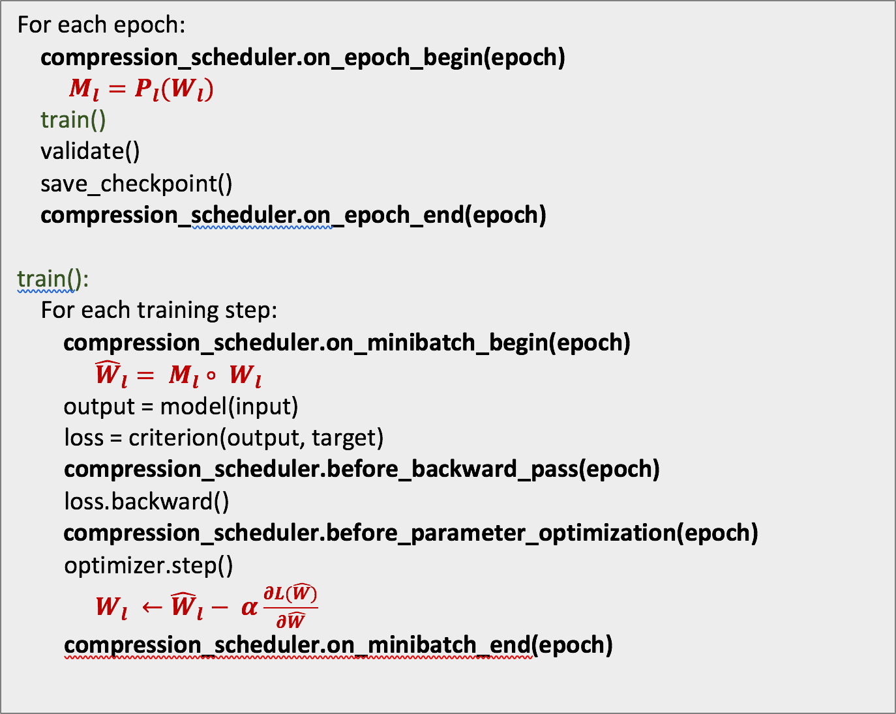
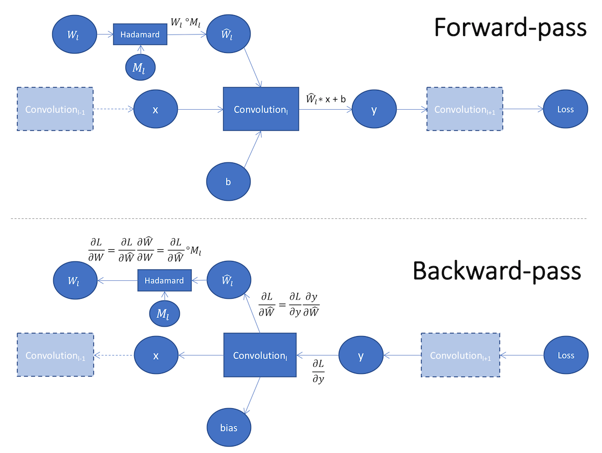

# Compression scheduler
In iterative pruning, we create some kind of pruning regimen that specifies how to prune, and what to prune at every stage of the pruning and training stages. This motivated the design of ```CompressionScheduler```: it needed to be part of the training loop, and to be able to make and implement pruning, regularization and quantization decisions.  We wanted to be able to change the particulars of the compression schedule, w/o touching the code, and settled on using YAML as a container for this specification.  We found that when we make many experiments on the same code base, it is easier to maintain all of these experiments if we decouple the differences from the code-base.  Therefore, we added to the scheduler support for learning-rate decay scheduling because, again, we wanted the freedom to change the LR-decay policy without changing code.  

## High level overview
Let's briefly discuss the main mechanisms and abstractions: A schedule specification is composed of a list of sections defining instances of Pruners, Regularizers, Quantizers, LR-scheduler and Policies.

  - Pruners, Regularizers and Quantizers are very similar: They implement either a Pruning/Regularization/Quantization algorithm, respectively. 
  - An LR-scheduler specifies the LR-decay algorithm.  

These define the **what** part of the schedule.  

The Policies define the **when** part of the schedule: at which epoch to start applying the Pruner/Regularizer/Quantizer/LR-decay, the epoch to end, and how often to invoke the policy (frequency of application).  A policy also defines the instance of Pruner/Regularizer/Quantizer/LR-decay it is managing.  
The `CompressionScheduler` is configured from a YAML file or from a dictionary, but you can also manually create Policies, Pruners, Regularizers and Quantizers from code.

## Syntax through example
We'll use ```alexnet.schedule_agp.yaml``` to explain some of the YAML syntax for configuring Sensitivity Pruning of Alexnet.
```
version: 1
pruners:
  my_pruner:
    class: 'SensitivityPruner'
    sensitivities:
      'features.module.0.weight': 0.25
      'features.module.3.weight': 0.35
      'features.module.6.weight': 0.40
      'features.module.8.weight': 0.45
      'features.module.10.weight': 0.55
      'classifier.1.weight': 0.875
      'classifier.4.weight': 0.875
      'classifier.6.weight': 0.625

lr_schedulers:
   pruning_lr:
     class: ExponentialLR
     gamma: 0.9

policies:
  - pruner:
      instance_name : 'my_pruner'
    starting_epoch: 0
    ending_epoch: 38
    frequency: 2

  - lr_scheduler:
      instance_name: pruning_lr
    starting_epoch: 24
    ending_epoch: 200
    frequency: 1
```

There is only one version of the YAML syntax, and the version number is not verified at the moment.  However, to be future-proof it is probably better to let the YAML parser know that you are using version-1 syntax, in case there is ever a version 2.
```
version: 1
```
In the ```pruners``` section, we define the instances of pruners we want the scheduler to instantiate and use.  
We define a single pruner instance, named ```my_pruner```, of algorithm ```SensitivityPruner```.  We will refer to this instance in the ```Policies``` section.  
Then we list the sensitivity multipliers, \\(s\\), of each of the weight tensors.  
You may list as many Pruners as you want in this section, as long as each has a unique name.  You can several types of pruners in one schedule.

```
pruners:
  my_pruner:
    class: 'SensitivityPruner'
    sensitivities:
      'features.module.0.weight': 0.25
      'features.module.3.weight': 0.35
      'features.module.6.weight': 0.40
      'features.module.8.weight': 0.45
      'features.module.10.weight': 0.55
      'classifier.1.weight': 0.875
      'classifier.4.weight': 0.875
      'classifier.6.weight': 0.6
```

Next, we want to specify the learning-rate decay scheduling in the ```lr_schedulers``` section.  We assign a name to this instance: ```pruning_lr```.  As in the ```pruners``` section, you may use any name, as long as all LR-schedulers have a unique name.  At the moment, only one instance of LR-scheduler is allowed.  The LR-scheduler must be a subclass of PyTorch's [\_LRScheduler](http://pytorch.org/docs/master/_modules/torch/optim/lr_scheduler.html).  You can use any of the schedulers defined in ```torch.optim.lr_scheduler``` (see [here](https://pytorch.org/docs/stable/optim.html#how-to-adjust-learning-rate)).  In addition, we've implemented some additional schedulers in Distiller (see [here](https://github.com/IntelLabs/distiller/blob/master/distiller/learning_rate.py)). The keyword arguments (kwargs) are passed directly to the LR-scheduler's constructor, so that as new LR-schedulers are added to ```torch.optim.lr_scheduler```, they can be used without changing the application code.

```
lr_schedulers:
   pruning_lr:
     class: ExponentialLR
     gamma: 0.9
```   

Finally, we define the ```policies``` section which defines the actual scheduling.  A ```Policy``` manages an instance of a ```Pruner```, ```Regularizer```, `Quantizer`, or ```LRScheduler```, by naming the instance.  In the example below, a ```PruningPolicy``` uses the pruner instance named ```my_pruner```: it activates it at a frequency of 2 epochs (i.e. every other epoch), starting at epoch 0, and ending at epoch 38.  
```
policies:
  - pruner:
      instance_name : 'my_pruner'
    starting_epoch: 0
    ending_epoch: 38
    frequency: 2

  - lr_scheduler:
      instance_name: pruning_lr
    starting_epoch: 24
    ending_epoch: 200
    frequency: 1
```
This is *iterative pruning*:

1. Train Connectivity

2. Prune Connections

3. Retrain Weights

4. Goto 2

It is described  in [Learning both Weights and Connections for Efficient Neural Networks](https://arxiv.org/abs/1506.02626):
> "Our method prunes redundant connections using a three-step method. First, we train the network to learn which connections are important. Next, we prune the unimportant connections. Finally, we retrain the network to fine tune the weights of the remaining connections...After an initial training phase, we remove all connections whose weight is lower than a threshold. This pruning converts a dense, fully-connected layer to a sparse layer. This first phase learns the topology of the networks — learning which connections are important and removing the unimportant connections. We then retrain the sparse network so the remaining connections can compensate for the connections that have been removed. The phases of pruning and retraining may be repeated iteratively to further reduce network complexity."

## Regularization
You can also define and schedule regularization.

### L1 regularization
Format (this is an informal specification, not a valid [ABNF](https://en.wikipedia.org/wiki/Augmented_Backus%E2%80%93Naur_form) specification):
```
regularizers:
  <REGULARIZER_NAME_STR>:
    class: L1Regularizer
    reg_regims:
      <PYTORCH_PARAM_NAME_STR>: <STRENGTH_FLOAT>
      ...
      <PYTORCH_PARAM_NAME_STR>: <STRENGTH_FLOAT>
    threshold_criteria: [Mean_Abs | Max]
```

For example:
```
version: 1

regularizers:
  my_L1_reg:
    class: L1Regularizer
    reg_regims:
      'module.layer3.1.conv1.weight': 0.000002
      'module.layer3.1.conv2.weight': 0.000002
      'module.layer3.1.conv3.weight': 0.000002
      'module.layer3.2.conv1.weight': 0.000002
    threshold_criteria: Mean_Abs

policies:
  - regularizer:
      instance_name: my_L1_reg
    starting_epoch: 0
    ending_epoch: 60
    frequency: 1
```

### Group regularization
Format (informal specification):
```
Format:
  regularizers:
    <REGULARIZER_NAME_STR>:
      class: L1Regularizer
      reg_regims:
        <PYTORCH_PARAM_NAME_STR>: [<STRENGTH_FLOAT>, <'2D' | '3D' | '4D' | 'Channels' | 'Cols' | 'Rows'>]
        <PYTORCH_PARAM_NAME_STR>: [<STRENGTH_FLOAT>, <'2D' | '3D' | '4D' | 'Channels' | 'Cols' | 'Rows'>]
      threshold_criteria: [Mean_Abs | Max]
```

For example:
```
version: 1

regularizers:
  my_filter_regularizer:
    class: GroupLassoRegularizer
    reg_regims:
      'module.layer3.1.conv1.weight': [0.00005, '3D']
      'module.layer3.1.conv2.weight': [0.00005, '3D']
      'module.layer3.1.conv3.weight': [0.00005, '3D']
      'module.layer3.2.conv1.weight': [0.00005, '3D']
    threshold_criteria: Mean_Abs

policies:
  - regularizer:
      instance_name: my_filter_regularizer
    starting_epoch: 0
    ending_epoch: 60
    frequency: 1
```

## Mixing it up
You can mix pruning and regularization.

```
version: 1
pruners:
  my_pruner:
    class: 'SensitivityPruner'
    sensitivities:
      'features.module.0.weight': 0.25
      'features.module.3.weight': 0.35
      'features.module.6.weight': 0.40
      'features.module.8.weight': 0.45
      'features.module.10.weight': 0.55
      'classifier.1.weight': 0.875
      'classifier.4.weight': 0.875
      'classifier.6.weight': 0.625

regularizers:
  2d_groups_regularizer:
    class: GroupLassoRegularizer
    reg_regims:
      'features.module.0.weight': [0.000012, '2D']
      'features.module.3.weight': [0.000012, '2D']
      'features.module.6.weight': [0.000012, '2D']
      'features.module.8.weight': [0.000012, '2D']
      'features.module.10.weight': [0.000012, '2D']


lr_schedulers:
  # Learning rate decay scheduler
   pruning_lr:
     class: ExponentialLR
     gamma: 0.9

policies:
  - pruner:
      instance_name : 'my_pruner'
    starting_epoch: 0
    ending_epoch: 38
    frequency: 2

  - regularizer:
      instance_name: '2d_groups_regularizer'
    starting_epoch: 0
    ending_epoch: 38
    frequency: 1

  - lr_scheduler:
      instance_name: pruning_lr
    starting_epoch: 24
    ending_epoch: 200
    frequency: 1

```

## Quantization-Aware Training

Similarly to pruners and regularizers, specifying a quantizer in the scheduler YAML follows the constructor arguments of the `Quantizer` class (see details [here](design.md#quantization)). **Note** that only a single quantizer instance may be defined per YAML.

Let's see an example:

```
quantizers:
  dorefa_quantizer:
    class: DorefaQuantizer
    bits_activations: 8
    bits_weights: 4
    overrides:
      conv1:
        bits_weights: null
        bits_activations: null
      relu1:
        bits_weights: null
        bits_activations: null
      final_relu:
        bits_weights: null
        bits_activations: null
      fc:
        bits_weights: null
        bits_activations: null
```

- The specific quantization method we're instantiating here is `DorefaQuantizer`.
- Then we define the default bit-widths for activations and weights, in this case 8 and 4-bits, respectively. 
- Then, we define the `overrides` mapping. In the example above, we choose not to quantize the first and last layer of the model. In the case of `DorefaQuantizer`, the weights are quantized as part of the convolution / FC layers, but the activations are quantized in separate layers, which replace the ReLU layers in the original model (remember - even though we replaced the ReLU modules with our own quantization modules, the name of the modules isn't changed). So, in all, we need to reference the first layer with parameters `conv1`, the first activation layer `relu1`, the last activation layer `final_relu` and the last layer with parameters `fc`.
- Specifying `null` means "do not quantize".
- Note that for quantizers, we reference names of modules, not names of parameters as we do for pruners and regularizers.

### Defining overrides for **groups of layers** using regular expressions

Suppose we have a sub-module in our model named `block1`, which contains multiple convolution layers which we would like to quantize to, say, 2-bits. The convolution layers are named `conv1`, `conv2` and so on. In that case we would define the following:

```
overrides:
  'block1\.conv*':
    bits_weights: 2
    bits_activations: null
```

- **RegEx Note**: Remember that the dot (`.`) is a meta-character (i.e. a reserved character) in regular expressions. So, to match the actual dot characters which separate sub-modules in PyTorch module names, we need to escape it: `\.`
    
**Overlapping patterns** are also possible, which allows to define some override for a groups of layers and also "single-out" specific layers for different overrides. For example, let's take the last example and configure a different override for `block1.conv1`:

```
overrides:
  'block1\.conv1':
    bits_weights: 4
    bits_activations: null
  'block1\.conv*':
    bits_weights: 2
    bits_activations: null
```

- **Important Note**: The patterns are evaluated eagerly - first match wins. So, to properly quantize a model using "broad" patterns and more "specific" patterns as just shown, make sure the specific pattern is listed **before** the broad one.


The `QuantizationPolicy`, which controls the quantization procedure during training, is actually quite simplistic. All it does is call the `prepare_model()` function of the `Quantizer` when it's initialized, followed by the first call to `quantize_params()`. Then, at the end of each epoch, after the float copy of the weights has been updated, it calls the `quantize_params()` function again.

```
policies:
  - quantizer:
      instance_name: dorefa_quantizer
      starting_epoch: 0
      ending_epoch: 200
      frequency: 1
```

**Important Note**: As mentioned [here](design.md#quantization-aware-training), since the quantizer modifies the model's parameters (assuming training with quantization in the loop is used), the call to `prepare_model()` must be performed before an optimizer is called. Therefore, currently, the starting epoch for a quantization policy must be 0, otherwise the quantization process will not work as expected. If one wishes to do a "warm-startup" (or "boot-strapping"), training for a few epochs with full precision and only then starting to quantize, the only way to do this right now is to execute a separate run to generate the boot-strapped weights, and execute a second which will resume the checkpoint with the boot-strapped weights.

## Post-Training Quantization

Post-training quantization differs from the other techniques described here. Since it is not executed during training, it does not require any Policies nor a Scheduler. Currently, the only method implemented for post-training quantization is [range-based linear quantization](algo_quantization.md#range-based-linear-quantization). Quantizing a model using this method, requires adding 2 lines of code:

```python
quantizer = distiller.quantization.PostTrainLinearQuantizer(model, <quantizer arguments>)
quantizer.prepare_model()
# Execute evaluation on model as usual
```

See the documentation for `PostTrainLinearQuantizer` in [range_linear.py](https://github.com/IntelLabs/distiller/blob/master/distiller/quantization/range_linear.py) for details on the available arguments.  
In addition to directly instantiating the quantizer with arguments, it can also be configured from a YAML file. The syntax for the YAML file is exactly the same as seen in the quantization-aware training section above. Not surprisingly, the `class` defined must be `PostTrainLinearQuantizer`, and any other components or policies defined in the YAML file are ignored. We'll see how to create the quantizer in this manner below.

If more configurability is needed, a helper function can be used that will add a set of command-line arguments to configure the quantizer:

```python
parser = argparse.ArgumentParser()
distiller.quantization.add_post_train_quant_args(parser)
args = parser.parse_args()
```

These are the available command line arguments:

```
Arguments controlling quantization at evaluation time ("post-training quantization"):
  --quantize-eval, --qe
                        Apply linear quantization to model before evaluation.
                        Applicable only if --evaluate is also set
  --qe-calibration PORTION_OF_TEST_SET
                        Run the model in evaluation mode on the specified
                        portion of the test dataset and collect statistics.
                        Ignores all other 'qe--*' arguments
  --qe-mode QE_MODE, --qem QE_MODE
                        Linear quantization mode. Choices: sym | asym_s |
                        asym_u
  --qe-bits-acts NUM_BITS, --qeba NUM_BITS
                        Number of bits for quantization of activations
  --qe-bits-wts NUM_BITS, --qebw NUM_BITS
                        Number of bits for quantization of weights
  --qe-bits-accum NUM_BITS
                        Number of bits for quantization of the accumulator
  --qe-clip-acts QE_CLIP_ACTS, --qeca QE_CLIP_ACTS
                        Activations clipping mode. Choices: none | avg | n_std
  --qe-clip-n-stds QE_CLIP_N_STDS
                        When qe-clip-acts is set to 'n_std', this is the
                        number of standard deviations to use
  --qe-no-clip-layers LAYER_NAME [LAYER_NAME ...], --qencl LAYER_NAME [LAYER_NAME ...]
                        List of layer names for which not to clip activations.
                        Applicable only if --qe-clip-acts is not 'none'
  --qe-per-channel, --qepc
                        Enable per-channel quantization of weights (per output
                        channel)
  --qe-scale-approx-bits NUM_BITS, --qesab NUM_BITS
                        Enable scale factor approximation using integer
                        multiply + bit shift, and uset his number of bits to
                        use for the integer multiplier
  --qe-stats-file PATH  Path to YAML file with calibration stats. If not
                        given, dynamic quantization will be run (Note that not
                        all layer types are supported for dynamic
                        quantization)
  --qe-config-file PATH
                        Path to YAML file containing configuration for
                        PostTrainLinearQuantizer (if present, all other --qe*
                        arguments are ignored)
```

(Note that `--quantize-eval` and `--qe-calibration` are mutually exclusive.)

When using these command line arguments, the quantizer can be invoked as follows:

```python
if args.quantize_eval:
    quantizer = distiller.quantization.PostTrainLinearQuantizer.from_args(model, args)
    quantizer.prepare_model()
    # Execute evaluation on model as usual
```

Note that the command-line arguments don't expose the `overrides` parameter of the quantizer, which allows fine-grained control over how each layer is quantized. To utilize this functionality, configure with a YAML file.

To see integration of these command line arguments in use, see the [image classification example](https://github.com/IntelLabs/distiller/blob/master/examples/classifier_compression/compress_classifier.py). 
For examples invocations of post-training quantization see [here](https://github.com/IntelLabs/distiller/blob/master/examples/quantization/post_train_quant).

### Collecting Statistics for Quantization

To collect generate statistics that can be used for static quantization of activations, do the following (shown here assuming the command line argument `--qe-calibration` shown above is used, which specifies the number of batches to use for statistics generation):

```python
if args.qe_calibration:
    distiller.utils.assign_layer_fq_names(model)
    msglogger.info("Generating quantization calibration stats based on {0} users".format(args.qe_calibration))
    collector = distiller.data_loggers.QuantCalibrationStatsCollector(model)
    with collector_context(collector):
        # Here call your model evaluation function, making sure to execute only
        # the portion of the dataset specified by the qe_calibration argument
    yaml_path = 'some/dir/quantization_stats.yaml'
    collector.save(yaml_path)
```

The genreated YAML stats file can then be provided using the ``--qe-stats-file` argument. An example of a generated stats file can be found [here](https://github.com/IntelLabs/distiller/blob/master/examples/quantization/post_train_quant/stats/resnet18_quant_stats.yaml).

## Pruning Fine-Control

Sometimes the default pruning process doesn't satisfy our needs and we require finer control over the pruning process (e.g. over masking, gradient handling, and weight updates).  Below we will explain the math and nuances of fine-control configuration.

### Setting up the problem

We represent the weights of a DNN as the set 
$$
\theta=\left\{\theta_{l} : 0 \leq l \leq : L\right\}
$$
where  \(\theta_{l}\)  represents the parameters tensor (weights and biases) of layer \( l \) in a network having \( L \) layers. Usually we do not prune biases because of their small size and relative importance.  Therefore, we will consider only the network weights (also known as network connections):
$$
W=\left\{W_{l} : 0 \leq l \leq : L\right\}
$$
We wish to optimize some objective (e.g. minimize the energy required to execute a network in inference mode) under some performance constraint (e.g. accuracy), and we do this by maximizing the sparsity of the network weights (sometimes under some chosen sparsity-pattern constraint).  

We formalize pruning as a 3-step action:

1. Generating a mask - in which we define a sparsity-inducing function per layer, \( P_l \), such that
   $$
   M_{l}=P_{l}\left(W_{l}\right)
   $$
   \( M_{l} \) is a binary matrix which is used to mask \( W_{l} \).  \( P_l\) is implemented by subclasses of ```distiller.pruner```.

2. Masking the weights using the Hadamard product:
   $$
   \widehat{W}_{l}=M_{l} \circ W_{l}
   $$

3. Updating the weights (performed by the optimizer).  By default, we compute the data-loss using the masked weights, and calculate the gradient of this loss with respect to the masked-weights.  We update the weights by making a small adjustment to the *masked weights*:
   $$
   W_{l} \leftarrow \widehat{W}_{l}-\alpha \frac{\partial Loss(\widehat{W}_{l})}{\partial \widehat{W}_{l}}
   $$
   We show below how to change this default behavior.  We also provide a more exact description of the weights update when using PyTorch's SGD optimizer.

The pruning regimen follows a pruning-rate schedule which, analogously to learning-rate annealing, changes the pruning rate according to a configurable strategy over time.  The schedule allows us to configure new masks either once at the beginning of epochs (most common), or at the beginning of mini-batches (for finer control).  In the former, the masks are calculated and assigned to \(\{M_{l}\}\) once, at the beginning of epochs (the specific epochs are determined by the schedule).  The pseudo-code below shows the typical training-loop with ```CompressionScheduler``` callbacks in bold font, and the three pruning actions described above in burgendy.

<center></center><br>
<center>**Figure 1: Pruning algorithm pseudo-code**</center>

We can perform masking by adding the masking operation to the network graph.  We call this *in-graph masking*, as depicted in the bottom of Figure 2.  In the forward-pass we apply element-wise multiplication of the weights \( W_{l} \) and the mask \( M_{l} \) to obtain the masked weights \(widehat{W}_{l}\) , which we apply to the Convolution operation.  In the backward-pass we mask \(\frac{\partial L}{\partial \widehat{W}}\) to obtain \(\frac{\partial L}{\partial W}\) with which we update \( W_{l} \).

<center></center><br>
<center>**Figure 2: Forward and backward weight masking**</center>

In Distiller we perform *out-of-graph masking* in which we directly set the value of \(\widehat{W}_{l}\) by applying a mask on \( W_{l} \)  In the backward-pass we make sure that the weights are updated by the *proper* gradients.  In the common pruning use-case we want the optimizer to update only the unmasked weights, but we can configure this behavior using the fine-control arguments, as explained below.

### Fine-Control

For finer control over the behavior of the pruning process, Distiller provides a set of ```PruningPolicy``` arguments in the ```args``` field, as in the sample below.

```YAML
pruners:
  random_filter_pruner:
    class: BernoulliFilterPruner
    desired_sparsity: 0.1
    group_type: Filters
    weights: [module.conv1.weight]

policies:
  - pruner:
      instance_name: random_filter_pruner
      args:
        mini_batch_pruning_frequency: 16
        discard_masks_at_minibatch_end: True
        use_double_copies: True
        mask_on_forward_only: True
        mask_gradients: True
    starting_epoch: 15
    ending_epoch: 180
    frequency: 1
```

#### Controls

- ```mini_batch_pruning_frequency``` (default: 0): controls pruning scheduling at the mini-batch granularity.  Every mini_batch_pruning_frequency training steps (i.e. mini_batches) we configure a new mask.  In between mask updates, we mask mini-batches with the current mask.

- ```discard_masks_at_minibatch_end``` (default: False): discards the pruning mask at the end of the mini-batch.  In the example YAML above, a new mask is computed once every 16 mini-batches, applied in one forward-pass, and then discraded.  In the next 15 mini-batches the mask is `Null` so we do not mask.

- ```mask_gradients``` (default: False): mask the weights gradients after performing the backward-pass, and before invoking the optimizer.  
  <br>
  One way to mask the gradients in PyTorch is to register to the backward callback of the weight tensors we want to mask, and alter the gradients there.  We do this by setting ```mask_gradients: True```, as in the sample YAML above.
  <br>
  This is sufficient if our weights optimization uses plain-vanilla SGD, because the update maintains the sparsity of the weights: \(\widehat{W}_{l}\) is sparse by definition, and the gradients are sparse because we mask them.
  $$
  W_{l} \leftarrow \widehat{W}_{l}-\alpha \frac{\partial Loss(\widehat{W}_{l})}{\partial \widehat{W}_{l}}
  $$
  <br>
  But this is not always the case.  For example, [PyTorch’s SGD optimizer](<https://github.com/pytorch/pytorch/blob/master/torch/optim/sgd.py>) with weight-decay (\(\lambda\)) and momentum (\(\alpha\)) has the optimization logic listed below:
  <br>1. \( \Delta p=\frac{\partial Loss\left(\widehat{W}_{l}^{i}\right)}{\partial \widehat{W}_{l}^{i}}+\lambda \widehat{W}_{l}^{i} \)
  <br>2. \( v_{i}=\left\lbrace
  \matrix{
    {\Delta p: \; if \;i==0 }\; \cr
    {v_{i-1} \rho+ (1-dampening)\Delta p: \; if \; i>0}
  }
  \right\rbrace \)<br>
  <br>3. \( W_{l}^{i+1} = \widehat{W}_{l}^{i}-\alpha v_{i} \)
  <br><br>
  Let’s look at the weight optimization update at some arbitrary step (i.e. mini-batch) *k*. 
  <br>
  We want to show that masking the weights and gradients (\(W_{l}^{i=k}\) and \(
  \frac{\partial Loss\left(\widehat{W}_{l}^{i=k}\right)}{\partial \widehat{W}_{l}^{i=k}}
  \)) is not sufficient to guarantee that \(W_{l}^{i=k+1}\) is sparse.  This is easy do: if we allow for the general case where \(v_i\) is not necessarily sparse, then \(W_{l}^{i+1}\) is not necessarily sparse.
  <hr>
  ***Masking the weights in the forward-pass, and gradients in the backward-pass, is not sufficient to maintain the sparsity of the weights!***
  <hr>
  This is an important insight, and it means that naïve in-graph masking is also not sufficient to guarantee sparsity of the updated weights. 
  
  - ```use_double_copies``` (default: False): 
  If you want to compute the gradients using the masked weights and also to update the unmasked weights (instead of updating the masked weights, per usual), set ```use_double_copies = True```.  This changes step (3) to: 
  <br>3. \( W_{l}^{i+1} = W_{1}^{i}-\alpha \Delta p \)
  <br>

  - ```mask_on_forward_only``` (default: False): when set to ```False``` the weights will *also* be masked after the Optimizer is done updating the weights, to remove any updates of the masked gradients.
  <br>
  If we want to guarantee the sparsity of the updated weights, we must explicitly mask the weights after step (3) above:
  <br>4. \( {W}_{l}^{i+1} \leftarrow M_{l}^{i} \circ {W}_{l}^{i+1} \)
  <br>
  This argument defaults to ```False```, but you can skip step (4), by setting ```mask_on_forward_only = True```.
  <br>
  Finally, note that ```mask_gradients``` and ```not mask_on_forward_only``` are mutually exclusive, or simply put: if you are masking in the backward-pass, you should choose to either do it via ```mask_gradients``` or ```mask_on_forward_only=False```, but not both.

## Knowledge Distillation

Knowledge distillation (see [here](knowledge_distillation.md)) is also implemented as a `Policy`, which should be added to the scheduler. However, with the current implementation, it cannot be defined within the YAML file like the rest of the policies described above.

To make the integration of this method into applications a bit easier, a helper function can be used that will add a set of command-line arguments related to knowledge distillation:

```
import argparse
import distiller

parser = argparse.ArgumentParser()
distiller.knowledge_distillation.add_distillation_args(parser)
```

(The `add_distillation_args` function accepts some optional arguments, see its implementation at `distiller/knowledge_distillation.py` for details)

These are the command line arguments exposed by this function:

```
Knowledge Distillation Training Arguments:
  --kd-teacher ARCH     Model architecture for teacher model
  --kd-pretrained       Use pre-trained model for teacher
  --kd-resume PATH      Path to checkpoint from which to load teacher weights
  --kd-temperature TEMP, --kd-temp TEMP
                        Knowledge distillation softmax temperature
  --kd-distill-wt WEIGHT, --kd-dw WEIGHT
                        Weight for distillation loss (student vs. teacher soft
                        targets)
  --kd-student-wt WEIGHT, --kd-sw WEIGHT
                        Weight for student vs. labels loss
  --kd-teacher-wt WEIGHT, --kd-tw WEIGHT
                        Weight for teacher vs. labels loss
  --kd-start-epoch EPOCH_NUM
                        Epoch from which to enable distillation

```

Once arguments have been parsed, some initialization code is required, similar to the following:

```
# Assuming:
# "args" variable holds command line arguments
# "model" variable holds the model we're going to train, that is - the student model
# "compression_scheduler" variable holds a CompressionScheduler instance

args.kd_policy = None
if args.kd_teacher:
    # Create teacher model - replace this with your model creation code
    teacher = create_model(args.kd_pretrained, args.dataset, args.kd_teacher, device_ids=args.gpus)
    if args.kd_resume:
        teacher, _, _ = apputils.load_checkpoint(teacher, chkpt_file=args.kd_resume)

    # Create policy and add to scheduler
    dlw = distiller.DistillationLossWeights(args.kd_distill_wt, args.kd_student_wt, args.kd_teacher_wt)
    args.kd_policy = distiller.KnowledgeDistillationPolicy(model, teacher, args.kd_temp, dlw)
    compression_scheduler.add_policy(args.kd_policy, starting_epoch=args.kd_start_epoch, ending_epoch=args.epochs,
                                     frequency=1)
```

Finally, during the training loop, we need to perform forward propagation through the teacher model as well. The `KnowledgeDistillationPolicy` class keeps a reference to both the student and teacher models, and exposes a `forward` function that performs forward propagation on both of them. Since this is not one of the standard policy callbacks, we need to call this function manually from our training loop, as follows:

```
if args.kd_policy is None:
    # Revert to a "normal" forward-prop call if no knowledge distillation policy is present
    output = model(input_var)
else:
    output = args.kd_policy.forward(input_var)
```

To see this integration in action, take a look at the image classification sample at `examples/classifier_compression/compress_classifier.py`.
