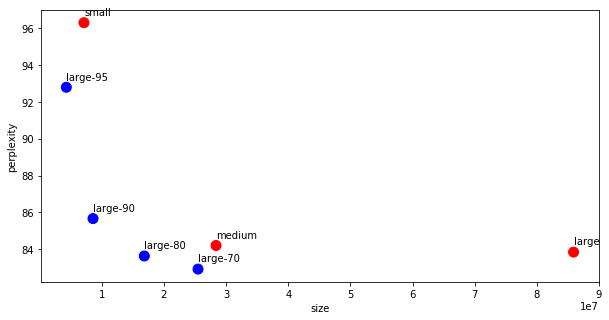

# Using Distiller to prune a PyTorch language model

## Contents
* [Introduction](#introduction)
* [Setup](#setup)
  - [Preparing the code](#preparing-the-code)
  - [Training-loop](#training-loop)
* [Creating compression baselines](#creating-compression-baselines)
* [Compressing the language model](#compressing-the-language-model)
  - [What are we compressing?](#what-are-we-compressing)
  - [How are we compressing?](#how-are-we-compressing)
  - [When are we compressing?](#when-are-we-compressing)
* [Until next time](#until-next-time)

## Introduction
In this tutorial I'll show you how to compress a word-level language model using [Distiller](https://github.com/IntelLabs/distiller).  Specifically, we use PyTorch’s [word-level language model sample code](https://github.com/pytorch/examples/tree/master/word_language_model) as the code-base of our example, weave in some Distiller code, and show how we compress the model using two different element-wise pruning algorithms.  To make things manageable, I've divided the tutorial to two parts: in the first we will setup the sample application and prune using [AGP](https://arxiv.org/abs/1710.01878).  In the second part I'll show how I've added Baidu's RNN pruning algorithm and then use it to prune the same word-level language model.  The completed code is available [here](https://github.com/IntelLabs/distiller/tree/master/examples/word_language_model).

The results are displayed below and the code is available [here](https://github.com/IntelLabs/distiller/tree/master/examples/word_language_model).
Note that we can improve the results by training longer, since the loss curves are usually still decreasing at the end of epoch 40.  However, for demonstration purposes we don’t need to do this.

| Type   | Sparsity |     NNZ     | Validation | Test  | Command line                                                                                                                                                            |
|--------|----------|:-----------:|------------|-------|-------------------------------------------------------------------------------------------------------------------------------------------------------------------------|
| Small  |       0% |   7,135,600 |   101.13   | 96.29 | time python3 main.py --cuda --epochs 40 --tied --wd=1e-6                                                                                                                |
| Medium |       0% |  28,390,700 |    88.17   | 84.21 | time python3 main.py --cuda --emsize 650 --nhid 650 --dropout 0.5 --epochs 40 --tied,--wd=1e-6                                                                          |
| Large  |       0% |  85,917,000 |    87.49   | 83.85 | time python3 main.py --cuda --emsize 1500 --nhid 1500 --dropout 0.65 --tied --wd=1e-6                                                                                   |
| Large  |      70% |  25,487,550 |    90.67   | 85.96 | time python3 main.py --cuda --emsize 1500 --nhid 1500 --dropout 0.65 --tied --compress=../../examples/agp-pruning/word_lang_model.LARGE_70.schedule_agp.yaml            |
| Large  |      70% |  25,487,550 |    90.59   | 85.84 | time python3 main.py --cuda --emsize 1500 --nhid 1500 --dropout 0.65 --tied --compress=../../examples/agp-pruning/word_lang_model.LARGE_70.schedule_agp.yaml --wd=1e-6  |
| Large  |      70% |  25,487,550 |    87.40   | 82.93 | time python3 main.py --cuda --emsize 1500 --nhid 1500 --dropout 0.65 --tied --compress=../../examples/agp-pruning/word_lang_model.LARGE_70B.schedule_agp.yaml --wd=1e-6 |
| Large  |    80.4% |  16,847,550 |    89.31   | 83.64 | time python3 main.py --cuda --emsize 1500 --nhid 1500 --dropout 0.65 --tied --compress=../../examples/agp-pruning/word_lang_model.LARGE_80.schedule_agp.yaml --wd=1e-6  |
| Large  |      90% |   8,591,700 |    90.70   | 85.67 | time python3 main.py --cuda --emsize 1500 --nhid 1500 --dropout 0.65 --tied --compress=../../examples/agp-pruning/word_lang_model.LARGE_90.schedule_agp.yaml --wd=1e-6  |
| Large  |      95% |   4,295,850 |    98.42   | 92.79 | time python3 main.py --cuda --emsize 1500 --nhid 1500 --dropout 0.65 --tied --compress=../../examples/agp-pruning/word_lang_model.LARGE_95.schedule_agp.yaml --wd=1e-6  |

<p align="center"><b>Table 1: AGP language model pruning results. <br>NNZ stands for number of non-zero coefficients (embeddings are counted once, because they are tied).</b></p>

<center></center>
<p align="center">
  <b>Figure 1: Perplexity vs model size (lower perplexity is better).</b>
</p>

The model is composed of an Encoder embedding, two LSTMs, and a Decoder embedding.  The Encoder and decoder embeddings (projections) are tied to improve perplexity results (per https://arxiv.org/pdf/1611.01462.pdf), so in the sparsity statistics we account for only one of the encoder/decoder embeddings.  We used the WikiText2 dataset (twice as large as PTB).

We compared three model sizes: small (7.1M; 14M), medium (28M; 50M), large: (86M; 136M) – reported as (#parameters net/tied; #parameters gross).
The results reported below use a preset seed (for reproducibility), and we expect results can be improved if we allow “true” pseudo-randomness.  We limited our tests to 40 epochs, even though validation perplexity was still trending down.

Essentially, this recreates the language model experiment in the AGP paper, and validates its conclusions:

* “We see that sparse models are able to outperform dense models which have significantly more parameters.”
* The 80% sparse large model (which has 16.9M parameters and a perplexity of 83.64) is able to outperform the dense medium (which has 28.4M parameters and a perplexity of 84.21), a model which has 1.7 times more parameters.  It also outperform the dense large model, which exemplifies how pruning can act as a regularizer.
* “Our results show that pruning works very well not only on the dense LSTM weights and dense softmax layer but also the dense embedding matrix. This suggests that during the optimization procedure the neural network can find a good sparse embedding for the words in the vocabulary that works well together with the sparse connectivity structure of the LSTM weights and softmax layer.”


## Setup

We start by cloning Pytorch’s example [repository](https://github.com/pytorch/examples/tree/master). I’ve copied the language model code to distiller’s examples/word_language_model directory, so I’ll use that for the rest of the tutorial.
Next, let’s create and activate a virtual environment, as explained in Distiller's [README](https://github.com/IntelLabs/distiller#installation) file.
Now we can turn our attention to [main.py](https://github.com/pytorch/examples/blob/master/word_language_model/main.py), which contains the training application.

### Preparing the code
We begin by adding code to invoke Distiller in file ```main.py```.  This involves a bit of mechanics, because we did not ```pip install``` Distiller in our environment (we don’t have a ```setup.py``` script for Distiller as of yet).  To make Distiller library functions accessible from ```main.py```, we modify ```sys.path``` to include the distiller root directory by taking the current directory and pointing two directories up.  This is very specific to the location of this example code, and it will break if you’ve placed the code elsewhere – so be aware.

```python
import os
import sys
script_dir = os.path.dirname(__file__)
module_path = os.path.abspath(os.path.join(script_dir, '..', '..'))
if module_path not in sys.path:
    sys.path.append(module_path)
import distiller
import apputils
from distiller.data_loggers import TensorBoardLogger, PythonLogger
```

Next, we augment the application arguments with two Distiller-specific arguments.  The first, ```--summary```, gives us the ability to do simple compression instrumentation (e.g. log sparsity statistics).  The second argument, ```--compress```, is how we tell the application where the compression scheduling file is located.
We also add two arguments - momentum and weight-decay - for the SGD optimizer.  As I explain later, I replaced the original code's optimizer with SGD, so we need these extra arguments.
```python
# Distiller-related arguments
SUMMARY_CHOICES = ['sparsity', 'model', 'modules', 'png', 'percentile']
parser.add_argument('--summary', type=str, choices=SUMMARY_CHOICES,
                    help='print a summary of the model, and exit - options: ' +
                    ' | '.join(SUMMARY_CHOICES))
parser.add_argument('--compress', dest='compress', type=str, nargs='?', action='store',
                    help='configuration file for pruning the model (default is to use hard-coded schedule)')
parser.add_argument('--momentum', default=0., type=float, metavar='M',
                    help='momentum')
parser.add_argument('--weight-decay', '--wd', default=0., type=float,
                    metavar='W', help='weight decay (default: 1e-4)')
```

We add code to handle the ```--summary``` application argument.  It can be as simple as forwarding to ```distiller.model_summary``` or more complex, as in the Distiller sample.
```python
if args.summary:
    distiller.model_summary(model, None, args.summary, 'wikitext2')
    exit(0)
```

Similarly, we add code to handle the ```--compress``` argument, which creates a CompressionScheduler and configures it from a YAML schedule file:
```python
if args.compress:
    source = args.compress
    compression_scheduler = distiller.CompressionScheduler(model)
    distiller.config.fileConfig(model, None, compression_scheduler, args.compress, msglogger)
```

We also create the optimizer, and the learning-rate decay policy scheduler.  The original PyTorch example manually manages the optimization and LR decay process, but I think that having a standard optimizer and LR-decay schedule gives us the flexibility to experiment with these during the training process.  Using an [SGD optimizer](https://pytorch.org/docs/stable/_modules/torch/optim/sgd.html) configured with ```momentum=0``` and ```weight_decay=0```, and a [ReduceLROnPlateau LR-decay policy](https://pytorch.org/docs/stable/_modules/torch/optim/lr_scheduler.html) with ```patience=0``` and ```factor=0.5``` will give the same behavior as in the original PyTorch example.  From there, we can experiment with the optimizer and LR-decay configuration.

```python
optimizer = torch.optim.SGD(model.parameters(), args.lr,
                            momentum=args.momentum,
                            weight_decay=args.weight_decay)
lr_scheduler = torch.optim.lr_scheduler.ReduceLROnPlateau(optimizer, mode='min',
                                                          patience=0, verbose=True, factor=0.5)
```

Next, we add code to setup the logging backends: a Python logger backend which reads its configuration from file and logs messages to the console and log file (```pylogger```); and a TensorBoard backend logger which logs statistics to a TensorBoard data file (```tflogger```).  I configured the TensorBoard backend to log gradients because RNNs suffer from vanishing and exploding gradients, so we might want to take a look in case the training experiences a sudden failure.
This code is not strictly required, but it is quite useful to be able to log the session progress, and to export logs to TensorBoard for realtime visualization of the training progress.

```python
# Distiller loggers
msglogger = apputils.config_pylogger('logging.conf', None)
tflogger = TensorBoardLogger(msglogger.logdir)
tflogger.log_gradients = True
pylogger = PythonLogger(msglogger)
```

### Training loop
Now we scroll down all the way to the train() function.  We'll change its signature to include the ```epoch```, ```optimizer```, and ```compression_schdule```.   We'll soon see why we need these.
```python
def train(epoch, optimizer, compression_scheduler=None)
```
Function ```train()``` is responsible for training the network in batches for one epoch, and in its epoch loop we want to perform compression.   The [CompressionScheduler](https://github.com/IntelLabs/distiller/blob/master/distiller/scheduler.py) invokes [ScheduledTrainingPolicy](https://github.com/IntelLabs/distiller/blob/master/distiller/policy.py) instances per the scheduling specification that was programmed in the ```CompressionScheduler``` instance.  There are four main ```SchedulingPolicy``` types: ```PruningPolicy```, ```RegularizationPolicy```, ```LRPolicy```, and ```QuantizationPolicy```.  We'll be using ```PruningPolicy```, which is triggered ```on_epoch_begin``` (to invoke the [Pruners](https://github.com/IntelLabs/distiller/blob/master/distiller/pruning), and ```on_minibatch_begin``` (to mask the weights).   Later we will create a YAML scheduling file, and specify the schedule of [AutomatedGradualPruner](https://github.com/IntelLabs/distiller/blob/master/distiller/pruning/automated_gradual_pruner.py) instances.  

Because we are writing a single application, which can be used with various Policies in the future (e.g. group-lasso regularization), we should add code to invoke all of the ```CompressionScheduler```'s callbacks, not just the mandatory ```on_epoch_begin``` callback.    We invoke ```on_minibatch_begin``` before running the forward-pass, ```before_backward_pass``` after computing the loss, and ```on_minibatch_end``` after completing the backward-pass.

<pre><code class="lang-python">
def train(epoch, optimizer, compression_scheduler=None):
    ...

    # The line below was fixed as per: https://github.com/pytorch/examples/issues/214
    for batch, i in enumerate(range(0, train_data.size(0), args.bptt)):
        data, targets = get_batch(train_data, i)
        # Starting each batch, we detach the hidden state from how it was previously produced.
        # If we didn't, the model would try backpropagating all the way to start of the dataset.
        hidden = repackage_hidden(hidden)

        <b>if compression_scheduler:
            compression_scheduler.on_minibatch_begin(epoch, minibatch_id=batch, minibatches_per_epoch=steps_per_epoch)</b>
        output, hidden = model(data, hidden)
        loss = criterion(output.view(-1, ntokens), targets)

        <b>if compression_scheduler:
            compression_scheduler.before_backward_pass(epoch, minibatch_id=batch,
                                                       minibatches_per_epoch=steps_per_epoch,
                                                       loss=loss)</b>
        optimizer.zero_grad()
        loss.backward()

        # `clip_grad_norm` helps prevent the exploding gradient problem in RNNs / LSTMs.
        torch.nn.utils.clip_grad_norm_(model.parameters(), args.clip)
        optimizer.step()

        total_loss += loss.item()

        <b>if compression_scheduler:
            compression_scheduler.on_minibatch_end(epoch, minibatch_id=batch, minibatches_per_epoch=steps_per_epoch)</b>
</code></pre>
The rest of the code could stay as in the original PyTorch sample, but I wanted to use an SGD optimizer, so I replaced:
```python
for p in model.parameters():
	p.data.add_(-lr, p.grad.data)
```
with:
```
optimizer.step()
```
The rest of the code in function ```train()``` logs to a text file and a [TensorBoard](https://www.tensorflow.org/programmers_guide/summaries_and_tensorboard) backend.  Again, such code is not mandatory, but a few lines give us a lot of visibility: we have training progress information saved to log, and we can monitor the training progress in realtime on TensorBoard.  That's a lot for a few lines of code ;-)

<pre><code>
if batch % args.log_interval == 0 and batch > 0:
    cur_loss = total_loss / args.log_interval
    elapsed = time.time() - start_time
    lr = optimizer.param_groups[0]['lr']
    msglogger.info(
            '| epoch {:3d} | {:5d}/{:5d} batches | lr {:02.4f} | ms/batch {:5.2f} '
            '| loss {:5.2f} | ppl {:8.2f}'.format(
        epoch, batch, len(train_data) // args.bptt, lr,
        elapsed * 1000 / args.log_interval, cur_loss, math.exp(cur_loss)))
    total_loss = 0
    start_time = time.time()
    stats = ('Peformance/Training/',
        OrderedDict([
            ('Loss', cur_loss),
            ('Perplexity', math.exp(cur_loss)),
            ('LR', lr),
            ('Batch Time', elapsed * 1000)])
        )
    steps_completed = batch + 1
    distiller.log_training_progress(stats, model.named_parameters(), epoch, steps_completed,
                                    steps_per_epoch, args.log_interval, [tflogger])
</code></pre>


Finally we get to the outer training-loop which loops on ```args.epochs```.  We add the two final ```CompressionScheduler``` callbacks: ```on_epoch_begin```, at the start of the loop, and ```on_epoch_end``` after running ```evaluate``` on the model and updating the learning-rate.

<pre><code class="lang-python">
try:
    for epoch in range(0, args.epochs):
        epoch_start_time = time.time()
        <b>if compression_scheduler:
            compression_scheduler.on_epoch_begin(epoch)</b>

        train(epoch, optimizer, compression_scheduler)
        val_loss = evaluate(val_data)
        lr_scheduler.step(val_loss)

        <b>if compression_scheduler:
            compression_scheduler.on_epoch_end(epoch)</b>
</code></pre>
And that's it!  The language model sample is ready for compression.  

## Creating compression baselines
In [To prune, or not to prune: exploring the efficacy of pruning for model compression](https://arxiv.org/abs/1710.01878) Zhu and Gupta, "compare the accuracy of large, but pruned models (large-sparse) and their smaller, but dense (small-dense) counterparts with identical memory footprint." They also "propose a new gradual pruning technique that is simple and straightforward to apply across a variety of models/datasets with minimal tuning."  
This pruning schedule is implemented by distiller.AutomatedGradualPruner (AGP), which increases the sparsity level (expressed as a percentage of zero-valued elements) gradually over several pruning steps. Distiller's implementation only prunes elements once in an epoch (the model is fine-tuned in between pruning events), which is a small deviation from Zhu and Gupta's paper. The research paper specifies the schedule in terms of mini-batches, while our implementation specifies the schedule in terms of epochs. We feel that using epochs performs well, and is more "stable", since the number of mini-batches will change, if you change the batch size.

Before we start compressing stuff ;-), we need to create baselines so we have something to benchmark against.  Let's prepare small, medium, and large baseline models, like Table 3 of *To prune, or Not to Prune*.  These will provide baseline perplexity results that we'll compare the compressed models against.    
I chose to use tied input/output embeddings, and constrained the training to 40 epochs.  The table below shows the model sizes, where we are interested in the tied version (biases are ignored due to their small size and because we don't prune them).

| Size   | Number of Weights (untied) | Number of Weights (tied) |
|--------|----------------------------|--------------------------|
| Small  | 13,951,200                 | 7,295,600                |
| Medium | 50,021,400                 | 28,390,700               |
| Large  | 135,834,000                | 85,917,000               |


I started experimenting with the optimizer setup like in the PyTorch example, but I added some L2 regularization when I noticed that the training was overfitting.  The two right columns show the perplexity results (lower is better) of each of the models with no L2 regularization and with 1e-5 and 1e-6.
In all three model sizes using the smaller L2 regularization (1e-6) gave the best results.  BTW, I'm not showing here experiments with even lower regularization because that did not help.

| Type   | Command line                                                                                   | Validation | Test   |
|--------|------------------------------------------------------------------------------------------------|------------|--------|
| Small  | time python3 main.py --cuda --epochs 40 --tied                                                 | 105.23     | 99.53  |
| Small  | time python3 main.py --cuda --epochs 40 --tied --wd=1e-6                                       | 101.13     | 96.29  |
| Small  | time python3 main.py --cuda --epochs 40 --tied --wd=1e-5                                       | 109.49     | 103.53 |
| Medium | time python3 main.py --cuda --emsize 650 --nhid 650 --dropout 0.5 --epochs 40 --tied           | 90.93      | 86.20  |
| Medium | time python3 main.py --cuda --emsize 650 --nhid 650 --dropout 0.5 --epochs 40 --tied --wd=1e-6 | 88.17      | 84.21  |
| Medium | time python3 main.py --cuda --emsize 650 --nhid 650 --dropout 0.5 --epochs 40 --tied --wd=1e-5 | 97.75      | 93.06  |
| Large  | time python3 main.py --cuda --emsize 1500 --nhid 1500 --dropout 0.65 --tied                    | 88.23      | 84.21  |
| Large  | time python3 main.py --cuda --emsize 1500 --nhid 1500 --dropout 0.65 --tied --wd=1e-6          | 87.49      | 83.85  |
| Large  | time python3 main.py --cuda --emsize 1500 --nhid 1500 --dropout 0.65 --tied --wd=1e-5          | 99.22      | 94.28  |


## Compressing the language model
OK, so now let's recreate the results of the language model experiment from section 4.2 of paper.  We're using PyTorch's sample, so the language model we implement is not exactly like the one in the AGP paper (and uses a different dataset), but it's close enough, so if everything goes well, we should see similar compression results.
### What are we compressing?
To gain insight about the model parameters, we can use the command-line to produce a weights-sparsity table:
```csh
$ python3 main.py --cuda --emsize 1500 --nhid 1500 --dropout 0.65 --tied --summary=sparsity

Parameters:
+---------+------------------+---------------+---------------+----------------+------------+------------+----------+----------+----------+------------+---------+----------+------------+
|         | Name             | Shape         |   NNZ (dense) |   NNZ (sparse) |   Cols (%) |   Rows (%) |   Ch (%) |   2D (%) |   3D (%) |   Fine (%) |     Std |     Mean |   Abs-Mean |
|---------+------------------+---------------+---------------+----------------+------------+------------+----------+----------+----------+------------+---------+----------+------------|
| 0.00000 | encoder.weight   | (33278, 1500) |      49917000 |       49916999 |    0.00000 |    0.00000 |        0 |  0.00000 |        0 |    0.00000 | 0.05773 | -0.00000 |    0.05000 |
| 1.00000 | rnn.weight_ih_l0 | (6000, 1500)  |       9000000 |        9000000 |    0.00000 |    0.00000 |        0 |  0.00000 |        0 |    0.00000 | 0.01491 |  0.00001 |    0.01291 |
| 2.00000 | rnn.weight_hh_l0 | (6000, 1500)  |       9000000 |        8999999 |    0.00000 |    0.00000 |        0 |  0.00000 |        0 |    0.00001 | 0.01491 |  0.00000 |    0.01291 |
| 3.00000 | rnn.weight_ih_l1 | (6000, 1500)  |       9000000 |        8999999 |    0.00000 |    0.00000 |        0 |  0.00000 |        0 |    0.00001 | 0.01490 | -0.00000 |    0.01291 |
| 4.00000 | rnn.weight_hh_l1 | (6000, 1500)  |       9000000 |        9000000 |    0.00000 |    0.00000 |        0 |  0.00000 |        0 |    0.00000 | 0.01491 | -0.00000 |    0.01291 |
| 5.00000 | decoder.weight   | (33278, 1500) |      49917000 |       49916999 |    0.00000 |    0.00000 |        0 |  0.00000 |        0 |    0.00000 | 0.05773 | -0.00000 |    0.05000 |
| 6.00000 | Total sparsity:  | -             |     135834000 |      135833996 |    0.00000 |    0.00000 |        0 |  0.00000 |        0 |    0.00000 | 0.00000 |  0.00000 |    0.00000 |
+---------+------------------+---------------+---------------+----------------+------------+------------+----------+----------+----------+------------+---------+----------+------------+
Total sparsity: 0.00
```

So what's going on here?
```encoder.weight``` and ```decoder.weight``` are the input and output embeddings, respectively.  Remember that in the configuration I chose for the three model sizes these embeddings are tied, which means that we only have one copy of parameters, that is shared between the encoder and decoder.
We also have two pairs of RNN (LSTM really) parameters.  There is a pair because the model uses the command-line argument ```args.nlayers``` to decide how many instances of RNN (or LSTM or GRU) cells to use, and it defaults to 2.  The recurrent cells are LSTM cells, because this is the default of ```args.model```, which is used in the initialization of ```RNNModel```.  Let's look at the parameters of the first RNN: ```rnn.weight_ih_l0``` and ```rnn.weight_hh_l0```: what are these?  
Recall the [LSTM equations](https://pytorch.org/docs/stable/nn.html#lstm) that PyTorch implements.  In the equations, there are 8 instances of vector-matrix multiplication (when batch=1).  These can be combined into a single matrix-matrix multiplication (GEMM), but PyTorch groups these into two GEMM operations: one GEMM multiplies the inputs (```rnn.weight_ih_l0```), and the other multiplies the hidden-state (```rnn.weight_hh_l0```).  
### How are we compressing?
Let's turn to the configurations of the Large language model compression schedule to 70%, 80%, 90% and 95% sparsity. Using AGP it is easy to configure the pruning schedule to produce an exact sparsity of the compressed model.  I'll use the [70% schedule](https://github.com/IntelLabs/distiller/blob/master/examples/agp-pruning/word_lang_model.LARGE_70.schedule_agp.yaml) to show a concrete example.

The YAML file has two sections: ```pruners``` and ```policies```.  Section ```pruners``` defines instances of ```ParameterPruner``` - in our case we define three instances of ```AutomatedGradualPruner```: for the weights of the first RNN (```l0_rnn_pruner```), the second RNN (```l1_rnn_pruner```) and the embedding layer (```embedding_pruner```).  These names are arbitrary, and serve are name-handles which bind Policies to Pruners - so you can use whatever names you want.
Each ```AutomatedGradualPruner``` is configured with an ```initial_sparsity``` and ```final_sparsity```.  For examples, the ```l0_rnn_pruner``` below is configured to prune 5% of the weights as soon as it starts working, and finish when 70% of the weights have been pruned.  The ```weights``` parameter tells the Pruner which weight tensors to prune.

```YAML
pruners:
  l0_rnn_pruner:
    class: AutomatedGradualPruner
    initial_sparsity : 0.05
    final_sparsity: 0.70
    weights: [rnn.weight_ih_l0, rnn.weight_hh_l0]

  l1_rnn_pruner:
    class: AutomatedGradualPruner
    initial_sparsity : 0.05
    final_sparsity: 0.70
    weights: [rnn.weight_ih_l1, rnn.weight_hh_l1]

  embedding_pruner:
    class: AutomatedGradualPruner
    initial_sparsity : 0.05
    final_sparsity: 0.70
    weights: [encoder.weight]
```
### When are we compressing?
If the ```pruners``` section defines "what-to-do", the ```policies``` section defines "when-to-do".  This part is harder, because we define the pruning schedule, which requires us to try a few different schedules until we understand which schedule works best.
Below we define three [PruningPolicy](https://github.com/IntelLabs/distiller/blob/master/distiller/policy.py#L86) instances.  The first two instances start operating at epoch 2 (```starting_epoch```), end at epoch 20 (```ending_epoch```), and operate once every epoch (```frequency```; as I explained above, Distiller's Pruning scheduling operates only at ```on_epoch_begin```).  In between pruning operations, the pruned model is fine-tuned.

```YAML
policies:
  - pruner:
      instance_name : l0_rnn_pruner
    starting_epoch: 2
    ending_epoch: 20  
    frequency: 1

  - pruner:
      instance_name : l1_rnn_pruner
    starting_epoch: 2
    ending_epoch: 20
    frequency: 1

  - pruner:
      instance_name : embedding_pruner
    starting_epoch: 3
    ending_epoch: 21
    frequency: 1
```

We invoke the compression as follows:
```
$ time python3 main.py --cuda --emsize 1500 --nhid 1500 --dropout 0.65 --tied --compress=../../examples/agp-pruning/word_lang_model.LARGE_70.schedule_agp.yaml
```
[Table 1](https://github.com/IntelLabs/distiller/wiki/Tutorial%3A-Pruning-a-PyTorch-language-model/_edit#table-1-agp-language-model-pruning-results) above shows that we can make a negligible improvement when adding L2 regularization.  I did some experimenting with the sparsity distribution between the layers, and the scheduling frequency and noticed that the embedding layers are much less sensitive to pruning than the RNN cells.  I didn't notice any difference between the RNN cells, but I also didn't invest in this exploration.
A new [70% sparsity schedule](https://github.com/IntelLabs/distiller/blob/master/examples/agp-pruning/word_lang_model.LARGE_70B.schedule_agp.yaml), prunes the RNNs only to 50% sparsity, but prunes the embedding to 85% sparsity, and achieves almost a 3 points improvement in the test perplexity results.

We provide [similar pruning schedules](https://github.com/IntelLabs/distiller/tree/master/examples/agp-pruning) for the other compression rates.

## Until next time
This concludes the first part of the tutorial on pruning a PyTorch language model.  
In the next installment, I'll explain how we added an implementation of Baidu Research's [Exploring Sparsity in Recurrent Neural Networks](https://arxiv.org/abs/1704.05119) paper, and applied to this language model.

Geek On.
