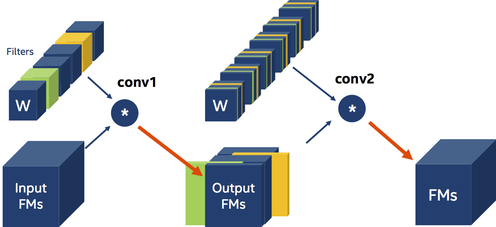
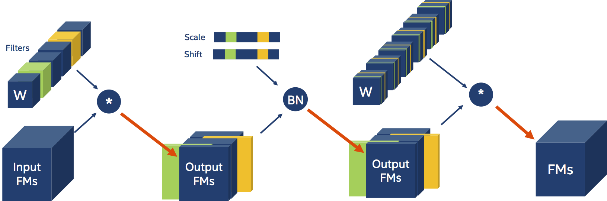
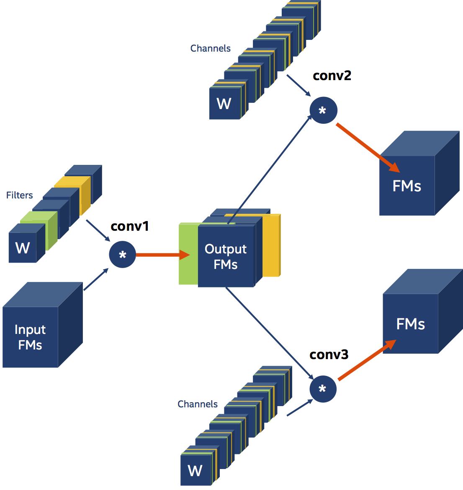
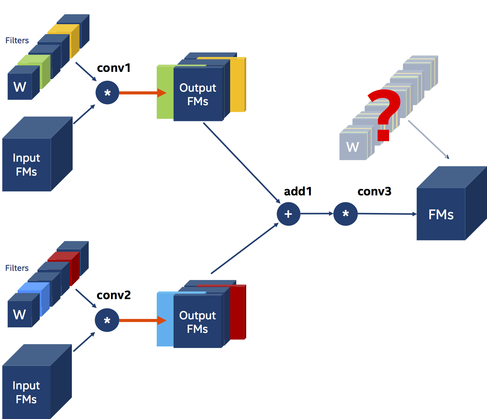
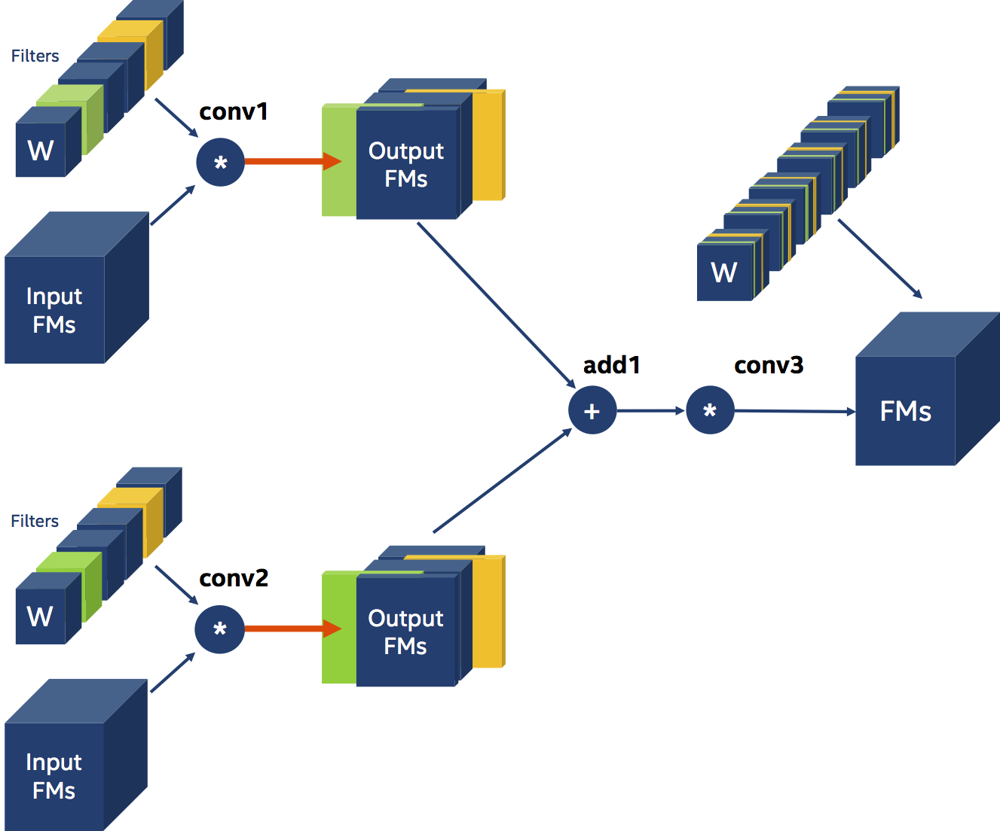

# Pruning Filters & Channels
## Introduction

Channel and filter pruning are examples of structured-pruning which create compressed models that do not require special hardware to execute.  This latter fact makes this form of structured pruning particularly interesting and popular.
In networks that have serial data dependencies, it is pretty straight-forward to understand and define how to prune channels and filters.  However, in more complex models,  with parallel-data dependencies (paths) - such as ResNets (skip connections) and GoogLeNet (Inception layers) – things become increasingly more complex and require a deeper understanding of the data flow in the model, in order to define the pruning schedule.  
This post explains channel and filter pruning, the challenges, and how to define a Distiller pruning schedule for these structures.  The details of the implementation are left for a separate post.

Before we dive into pruning, let’s level-set on the terminology, because different people (and even research papers) do not always agree on the nomenclature.  This reflects my understanding of the nomenclature, and therefore these are the names used in Distiller.  I’ll restrict this discussion to Convolution layers in CNNs, to contain the scope of the topic I’ll be covering, although Distiller supports pruning of other structures such as matrix columns and rows.
PyTorch describes [```torch.nn.Conv2d```]( https://pytorch.org/docs/stable/nn.html#conv2d) as applying “a 2D convolution over an input signal composed of several input planes.”  We call each of these input planes a **feature-map** (or FM, for short).  Another name is **input channel**, as in the R/G/B channels of an image.  Some people refer to feature-maps as **activations** (i.e. the activation of neurons), although I think strictly speaking **activations** are the output of an activation layer that was fed a group of feature-maps.  Because it is very common, and because the use of an activation is orthogonal to our discussion, I will use **activations** to refer to the output of a Convolution layer (i.e. 3D stack of feature-maps).

In the PyTorch documentation Convolution outputs have shape (N, C<sub>out</sub>, H<sub>out</sub>, W<sub>out</sub>) where N is a batch size, C<sub>out</sub> denotes a number of output channels, H<sub>out</sub> is a height of output planes in pixels, and W<sub>out</sub> is width in pixels.  We won’t be paying much attention to the batch-size since it’s not important to our discussion, so without loss of generality we can set N=1.  I’m also assuming the most common Convolutions having ```groups==1```.
Convolution weights are 4D: (F, C, K, K) where F is the number of filters, C is the number of channels, and K is the kernel size (we can assume the kernel height and width are equal for simplicity).  A **kernel** is a 2D matrix (K, K) that is part of a 3D feature detector.  This feature detector is called a **filter** and it is basically a stack of 2D **kernels**.  Each kernel is convolved with a 2D input channel (i.e. feature-map) so if there are C<sub>in</sub> channels in the input, then there are C<sub>in</sub> kernels in a filter (C == C<sub>in</sub>).  Each filter is convolved with the entire input to create a single output channel (i.e. feature-map).  If there are C<sub>out</sub> output channels, then there are C<sub>out</sub> filters (F == C<sub>out</sub>).

## Filter Pruning
Filter pruning and channel pruning are very similar, and I’ll expand on that similarity later on – but for now let’s focus on filter pruning.  
In filter pruning we use some criterion to determine which filters are **important** and which are not.  Researchers came up with all sorts of pruning criteria: the L1-magnitude of the filters (citation), the entropy of the activations (citation), and the classification accuracy reduction (citation) are just some examples.  Disregarding how we chose the filters to prune, let’s imagine that in the diagram below, we chose to prune (remove) the green and orange filters (the circle with the “*” designates a Convolution operation).

Since we have two less filters operating on the input, we must have two less output feature-maps.  So when we prune filters, besides changing the physical size of the weight tensors, we also need to reconfigure the immediate Convolution layer (change its ```out_channels```) and the following Convolution layer (change its ```in_channels```).  And finally, because the next layer’s input is now smaller (has fewer channels),  we should also shrink the next layer’s weights tensors, by removing the channels corresponding to the filters we pruned.  We say that there is a **data-dependency** between the two Convolution layers.  I didn’t make any mention of the activation function that usually follows Convolution, because these functions are parameter-less and are not sensitive to the shape of their input.
There are some other dependencies that Distiller resolves (such as Optimizer parameters tightly-coupled to the weights) that I won’t discuss here, because they are implementation details.
<center></center>

The scheduler YAML syntax for this example is pasted below.  We use L1-norm ranking of weight filters, and the pruning-rate is set by the AGP algorithm (Automatic Gradual Pruning).  The Convolution layers are conveniently named ```conv1``` and ```conv2``` in this example.

```
pruners:
  example_pruner:
    class: L1RankedStructureParameterPruner_AGP
    initial_sparsity : 0.10
    final_sparsity: 0.50
    group_type: Filters
    weights: [module.conv1.weight]
```

Now let’s add a Batch Normalization layer between the two convolutions:
<center></center>

The Batch Normalization layer is parameterized by a couple of tensors that contain information per input-channel (i.e. scale and shift).  Because our Convolution produces less output FMs, and these are the input to the Batch Normalization layer, we also need to reconfigure the Batch Normalization layer.  And we also need to physically shrink the Batch Normalization layer’s scale and shift tensors, which are coefficients in the BN input transformation.  Moreover, the scale and shift coefficients that we remove from the tensors, must correspond to the filters (or output feature-maps channels) that we removed from the Convolution weight tensors.  This small nuance will prove to be a large pain, but we’ll get to that in later examples.
The presence of a Batch Normalization layer in the example above is transparent to us, and in fact, the YAML schedule does not change.  Distiller detects the presence of Batch Normalization layers and adjusts their parameters automatically.

Let’s look at another example, with non-serial data-dependencies.  Here, the output of ```conv1``` is the input for ```conv2``` and ```conv3```.  This is an example of parallel data-dependency, since both ```conv2``` and ```conv3``` depend on ```conv1```.
<center></center>

Note that the Distiller YAML schedule is unchanged from the previous two examples, since we are still only explicitly pruning the weight filters of ```conv1```.  The weight channels of ```conv2``` and ```conv3``` are pruned implicitly by Distiller in a process called “Thinning” (on which I will expand in a different post).

Next, let’s look at another example also involving three Convolutions, but this time we want to prune the filters of two convolutional layers, whose outputs are element-wise-summed and fed into a third Convolution.
In this example ```conv3``` is dependent on both ```conv1``` and ```conv2```, and there are two implications to this dependency.  The first, and more obvious implication, is that we need to prune the same number of filters from both ```conv1``` and ```conv2```.  Since we apply element-wise addition on the outputs of ```conv1``` and ```conv2```, they must have the same shape - and they can only have the same shape if ```conv1``` and ```conv2``` prune the same number of filters.  The second implication of this triangular data-dependency is that both ```conv1``` and ```conv2``` must prune the **same** filters!  Let’s imagine for a moment, that we ignore this second constraint.  The diagram below illustrates the dilemma that arises: how should we prune the channels of the weights of ```conv3```?  Obviously, we can’t.
<center></center>


We must apply the second constraint – and that means that we now need to be proactive: we need to decide whether to use the prune ```conv1``` and ```conv2``` according to the filter-pruning choices of ```conv1``` or of ```conv2```.  The diagram below illustrates the pruning scheme after deciding to follow the pruning choices of ```conv1```.
<center></center>

The YAML compression schedule syntax needs to be able to express the two dependencies (or constraints) discussed above.  First we need to tell the Filter Pruner that we there is a dependency of type **Leader**.  This means that all of the tensors listed in the ```weights``` field are pruned together, to the same extent at each iteration, and that to prune the filters we will use the pruning decisions of the first tensor listed.  In the example below ```module.conv1.weight``` and ```module.conv2.weight``` are pruned together according to the pruning choices for ```module.conv1.weight```.

```
pruners:
  example_pruner:
    class: L1RankedStructureParameterPruner_AGP
    initial_sparsity : 0.10
    final_sparsity: 0.50
    group_type: Filters
    group_dependency: Leader
    weights: [module.conv1.weight, module.conv2.weight]
```

When we turn to filter-pruning ResNets we see some pretty long dependency chains because of the skip-connections.  If you don’t pay attention, you can easily under-specify (or mis-specify) dependency chains and Distiller will exit with an exception.  The exception does not explain the specification error and this needs to be improved.

## Channel Pruning

Channel pruning is very similar to Filter pruning with all the details of dependencies reversed.  Look again at example #1, but this time imagine that we’ve changed our schedule to prune the **channels** of ```module.conv2.weight```.

```
pruners:
  example_pruner:
    class: L1RankedStructureParameterPruner_AGP
    initial_sparsity : 0.10
    final_sparsity: 0.50
    group_type: Channels
    weights: [module.conv2.weight]
```

As the diagram shows, ```conv1``` is now dependent on ```conv2``` and its weights filters will be implicitly pruned according to the channels removed from the weights of ```conv2```.
<center></center>

Geek On.
