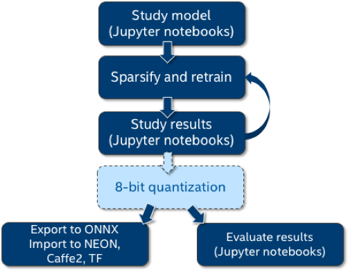

# Using the sample application

The Distiller repository contains a sample application, ```distiller/examples/classifier_compression/compress_classifier.py```, and a set of scheduling files which demonstrate Distiller's features.  Following is a brief discussion of how to use this application and the accompanying schedules.

You might also want to refer to the following resources:

* An [explanation](https://nervanasystems.github.io/distiller/schedule/index.html) of the scheduler file format.
* An in-depth [discussion](https://nervanasystems.github.io/distiller/model_zoo/index.html) of how we used these schedule files to implement several state-of-the-art DNN compression research papers.

The sample application supports various features for compression of image classification DNNs, and gives an example of how to integrate distiller in your own application.  The code is documented and should be considered the best source of documentation, but we provide some elaboration here.

This diagram shows how where ```compress_classifier.py``` fits in the compression workflow, and how we integrate the Jupyter notebooks as part of our research work.
<center></center><br>

## Command line arguments

To get help on the command line arguments, invoke:
```
$ python3 compress_classifier.py --help
```

For example:

```
$ time python3 compress_classifier.py -a alexnet --lr 0.005 -p 50 ../../../data.imagenet -j 44 --epochs 90 --pretrained --compress=../sensitivity-pruning/alexnet.schedule_sensitivity.yaml

Parameters:
 +----+---------------------------+------------------+---------------+----------------+------------+------------+----------+----------+----------+------------+---------+----------+------------+
 |    | Name                      | Shape            |   NNZ (dense) |   NNZ (sparse) |   Cols (%) |   Rows (%) |   Ch (%) |   2D (%) |   3D (%) |   Fine (%) |     Std |     Mean |   Abs-Mean |
 |----+---------------------------+------------------+---------------+----------------+------------+------------+----------+----------+----------+------------+---------+----------+------------|
 |  0 | features.module.0.weight  | (64, 3, 11, 11)  |         23232 |          13411 |    0.00000 |    0.00000 |  0.00000 |  0.00000 |  0.00000 |   42.27359 | 0.14391 | -0.00002 |    0.08805 |
 |  1 | features.module.3.weight  | (192, 64, 5, 5)  |        307200 |         115560 |    0.00000 |    0.00000 |  0.00000 |  1.91243 |  0.00000 |   62.38281 | 0.04703 | -0.00250 |    0.02289 |
 |  2 | features.module.6.weight  | (384, 192, 3, 3) |        663552 |         256565 |    0.00000 |    0.00000 |  0.00000 |  6.18490 |  0.00000 |   61.33445 | 0.03354 | -0.00184 |    0.01803 |
 |  3 | features.module.8.weight  | (256, 384, 3, 3) |        884736 |         315065 |    0.00000 |    0.00000 |  0.00000 |  6.96411 |  0.00000 |   64.38881 | 0.02646 | -0.00168 |    0.01422 |
 |  4 | features.module.10.weight | (256, 256, 3, 3) |        589824 |         186938 |    0.00000 |    0.00000 |  0.00000 | 15.49225 |  0.00000 |   68.30614 | 0.02714 | -0.00246 |    0.01409 |
 |  5 | classifier.1.weight       | (4096, 9216)     |      37748736 |        3398881 |    0.00000 |    0.21973 |  0.00000 |  0.21973 |  0.00000 |   90.99604 | 0.00589 | -0.00020 |    0.00168 |
 |  6 | classifier.4.weight       | (4096, 4096)     |      16777216 |        1782769 |    0.21973 |    3.46680 |  0.00000 |  3.46680 |  0.00000 |   89.37387 | 0.00849 | -0.00066 |    0.00263 |
 |  7 | classifier.6.weight       | (1000, 4096)     |       4096000 |         994738 |    3.36914 |    0.00000 |  0.00000 |  0.00000 |  0.00000 |   75.71440 | 0.01718 |  0.00030 |    0.00778 |
 |  8 | Total sparsity:           | -                |      61090496 |        7063928 |    0.00000 |    0.00000 |  0.00000 |  0.00000 |  0.00000 |   88.43694 | 0.00000 |  0.00000 |    0.00000 |
 +----+---------------------------+------------------+---------------+----------------+------------+------------+----------+----------+----------+------------+---------+----------+------------+
 2018-04-04 21:30:52,499 - Total sparsity: 88.44

 2018-04-04 21:30:52,499 - --- validate (epoch=89)-----------
 2018-04-04 21:30:52,499 - 128116 samples (256 per mini-batch)
 2018-04-04 21:31:04,646 - Epoch: [89][   50/  500]    Loss 2.175988    Top1 51.289063    Top5 74.023438
 2018-04-04 21:31:06,427 - Epoch: [89][  100/  500]    Loss 2.171564    Top1 51.175781    Top5 74.308594
 2018-04-04 21:31:11,432 - Epoch: [89][  150/  500]    Loss 2.159347    Top1 51.546875    Top5 74.473958
 2018-04-04 21:31:14,364 - Epoch: [89][  200/  500]    Loss 2.156857    Top1 51.585938    Top5 74.568359
 2018-04-04 21:31:18,381 - Epoch: [89][  250/  500]    Loss 2.152790    Top1 51.707813    Top5 74.681250
 2018-04-04 21:31:22,195 - Epoch: [89][  300/  500]    Loss 2.149962    Top1 51.791667    Top5 74.755208
 2018-04-04 21:31:25,508 - Epoch: [89][  350/  500]    Loss 2.150936    Top1 51.827009    Top5 74.767857
 2018-04-04 21:31:29,538 - Epoch: [89][  400/  500]    Loss 2.150853    Top1 51.781250    Top5 74.763672
 2018-04-04 21:31:32,842 - Epoch: [89][  450/  500]    Loss 2.150156    Top1 51.828125    Top5 74.821181
 2018-04-04 21:31:35,338 - Epoch: [89][  500/  500]    Loss 2.150417    Top1 51.833594    Top5 74.817187
 2018-04-04 21:31:35,357 - ==> Top1: 51.838    Top5: 74.817    Loss: 2.150

 2018-04-04 21:31:35,364 - Saving checkpoint
 2018-04-04 21:31:39,251 - --- test ---------------------
 2018-04-04 21:31:39,252 - 50000 samples (256 per mini-batch)
 2018-04-04 21:31:51,512 - Test: [   50/  195]    Loss 1.487607    Top1 63.273438    Top5 85.695312
 2018-04-04 21:31:55,015 - Test: [  100/  195]    Loss 1.638043    Top1 60.636719    Top5 83.664062
 2018-04-04 21:31:58,732 - Test: [  150/  195]    Loss 1.833214    Top1 57.619792    Top5 80.447917
 2018-04-04 21:32:01,274 - ==> Top1: 56.606    Top5: 79.446    Loss: 1.893
```

Let's look at the command line again:
```
$ time python3 compress_classifier.py -a alexnet --lr 0.005 -p 50 ../../../data.imagenet -j 44 --epochs 90 --pretrained --compress=../sensitivity-pruning/alexnet.schedule_sensitivity.yaml
```

In this example, we prune a TorchVision pre-trained AlexNet network, using the following configuration:

  - Learning-rate of 0.005
  - Print progress every 50 mini-batches.
  - Use 44 worker threads to load data (make sure to use something suitable for your machine).
  - Run for 90 epochs.  Torchvision's pre-trained models did not store the epoch metadata, so pruning starts at epoch 0.  When you train and prune your own networks, the last training epoch is saved as a metadata with the model.  Therefore, when you load such models, the first epoch is not 0, but it is the last training epoch.
  - The pruning schedule is provided in ```alexnet.schedule_sensitivity.yaml```
  - Log files are written to directory ```logs```.

## Examples
Distiller comes with several example schedules which can be used together with ```compress_classifier.py```.
These example schedules (YAML) files, contain the command line that is used in order to invoke the schedule (so that you can easily recreate the results in your environment), together with the results of the pruning or regularization.  The results usually contain a table showing the sparsity of  each of the model parameters, together with the validation and test top1, top5 and loss scores.

For more details on the example schedules, you can refer to the coverage of the [Model Zoo](model_zoo.md).

* **examples/agp-pruning**:
    - Automated Gradual Pruning (AGP) on MobileNet and ResNet18 (ImageNet dataset)
<br><br>
* **examples/hybrid**:
    - AlexNet AGP with 2D (kernel) regularization (ImageNet dataset)
    - AlexNet sensitivity pruning with 2D regularization
<br><br>
* **examples/network_slimming**:
    - ResNet20 Network Slimming (this is work-in-progress)
<br><br>
* **examples/pruning_filters_for_efficient_convnets**:
    - ResNet56 baseline training (CIFAR10 dataset)
    - ResNet56 filter removal using filter ranking
<br><br>
* **examples/sensitivity_analysis**:
    - Element-wise pruning sensitivity-analysis:
      - AlexNet (ImageNet)
      - MobileNet (ImageNet)
      - ResNet18 (ImageNet)
      - ResNet20 (CIFAR10)
      - ResNet34 (ImageNet)
    - Filter-wise pruning sensitivity-analysis:
      - ResNet20 (CIFAR10)
      - ResNet56 (CIFAR10)
<br><br>
* **examples/sensitivity-pruning**:
    - AlexNet sensitivity pruning with Iterative Pruning
    - AlexNet sensitivity pruning with One-Shot Pruning
<br><br>
* **examples/ssl**:
    - ResNet20 baseline training (CIFAR10 dataset)
    - Structured Sparsity Learning (SSL) with layer removal on ResNet20
    - SSL with channels removal on ResNet20
<br><br>
* **examples/quantization**:
    - AlexNet w. Batch-Norm (base FP32 + DoReFa)
    - Pre-activation ResNet20 on CIFAR10 (base FP32 + DoReFa)
    - Pre-activation ResNet18 on ImageNEt (base FP32 + DoReFa)


## Experiment reproducibility
Experiment reproducibility is sometimes important.  Pete Warden recently expounded about this in his [blog](https://petewarden.com/2018/03/19/the-machine-learning-reproducibility-crisis/).  
PyTorch's support for deterministic execution requires us to use only one thread for loading data (other wise the multi-threaded execution of the data loaders can create random order and change the results), and to set the seed of the CPU and GPU PRNGs.  Using the ```--deterministic``` command-line flag and setting ```j=1``` will produce reproducible results (for the same PyTorch version).

## Performing pruning sensitivity analysis
Distiller supports element-wise and filter-wise pruning sensitivity analysis.  In both cases, L1-norm is used to rank which elements or filters to prune.  For example, when running filter-pruning sensitivity analysis, the L1-norm of the filters of each layer's weights tensor are calculated, and the bottom x% are set to zero.  <br>
The analysis process is quite long, because currently we use the entire test dataset to assess the accuracy performance at each pruning level of each weights tensor.  Using a small dataset for this would save much time and we plan on assessing if this will provide sufficient results.<br>
Results are output as a CSV file (```sensitivity.csv```) and PNG file (```sensitivity.png```).  The implementation is in ```distiller/sensitivity.py``` and it contains further details about process and the format of the CSV file.

The example below performs element-wise pruning sensitivity analysis on ResNet20 for CIFAR10:
```
$ python3 compress_classifier.py -a resnet20_cifar ../../../data.cifar10/ -j=1 --resume=../cifar10/resnet20/checkpoint_trained_dense.pth.tar --sense=element
```

The ```sense``` command-line argument can be set to either ```element``` or ```filter```, depending on the type of analysis you want done.<br>

There is also a [Jupyter notebook](http://localhost:8888/notebooks/sensitivity_analysis.ipynb) with example invocations, outputs and explanations.

## "Direct" Quantization Without Training
Distiller supports 8-bit quantization of trained modules without re-training (using [Symmetric Linear Quantization](algo_quantization.md#symmetric-linear-quantization)). So, any model (whether pruned or not) can be quantized.  
Use the ```--quantize``` command-line flag, together with ```--evaluate``` to evaluate the accuracy of your model after quantization.  The following example qunatizes ResNet18 for ImageNet:
```
$ python3 compress_classifier.py -a resnet18 ../../../data.imagenet  --pretrained --quantize --evaluate
```
Generates:
```
Preparing model for quantization
--- test ---------------------
50000 samples (256 per mini-batch)
Test: [   10/  195]    Loss 0.856354    Top1 79.257812    Top5 92.500000
Test: [   20/  195]    Loss 0.923131    Top1 76.953125    Top5 92.246094
Test: [   30/  195]    Loss 0.885186    Top1 77.955729    Top5 92.486979
Test: [   40/  195]    Loss 0.930263    Top1 76.181641    Top5 92.597656
Test: [   50/  195]    Loss 0.931062    Top1 75.726562    Top5 92.906250
Test: [   60/  195]    Loss 0.932019    Top1 75.651042    Top5 93.151042
Test: [   70/  195]    Loss 0.921287    Top1 76.060268    Top5 93.270089
Test: [   80/  195]    Loss 0.932539    Top1 75.986328    Top5 93.100586
Test: [   90/  195]    Loss 0.996000    Top1 74.700521    Top5 92.330729
Test: [  100/  195]    Loss 1.066699    Top1 73.289062    Top5 91.437500
Test: [  110/  195]    Loss 1.100970    Top1 72.574574    Top5 91.001420
Test: [  120/  195]    Loss 1.122376    Top1 72.268880    Top5 90.696615
Test: [  130/  195]    Loss 1.171726    Top1 71.198918    Top5 90.120192
Test: [  140/  195]    Loss 1.191500    Top1 70.797991    Top5 89.902344
Test: [  150/  195]    Loss 1.219954    Top1 70.210938    Top5 89.453125
Test: [  160/  195]    Loss 1.240942    Top1 69.855957    Top5 89.162598
Test: [  170/  195]    Loss 1.265741    Top1 69.342831    Top5 88.807445
Test: [  180/  195]    Loss 1.281185    Top1 69.051649    Top5 88.589410
Test: [  190/  195]    Loss 1.279682    Top1 69.019326    Top5 88.632812
==> Top1: 69.130    Top5: 88.732    Loss: 1.276
```


## Summaries
You can use the sample compression application to generate model summary reports, such as the attributes and compute summary report (see screen capture below).
You can log sparsity statistics (written to console and CSV file), performance, optimizer and model information, and also create a PNG image of the DNN.
Creating a PNG image is an experimental feature (it relies on features which are not available on PyTorch 3.1 and that we hope will be available in PyTorch's next release), so to use it you will need to compile the PyTorch master branch, and hope for the best ;-).

```
$ python3 compress_classifier.py --resume=../ssl/checkpoints/checkpoint_trained_ch_regularized_dense.pth.tar -a=resnet20_cifar ../../../data.cifar10 --summary=compute
```
Generates:
```
+----+------------------------------+--------+----------+-----------------+--------------+-----------------+--------------+------------------+---------+
|    | Name                         | Type   | Attrs    | IFM             |   IFM volume | OFM             |   OFM volume |   Weights volume |    MACs |
|----+------------------------------+--------+----------+-----------------+--------------+-----------------+--------------+------------------+---------|
|  0 | module.conv1                 | Conv2d | k=(3, 3) | (1, 3, 32, 32)  |         3072 | (1, 16, 32, 32) |        16384 |              432 |  442368 |
|  1 | module.layer1.0.conv1        | Conv2d | k=(3, 3) | (1, 16, 32, 32) |        16384 | (1, 16, 32, 32) |        16384 |             2304 | 2359296 |
|  2 | module.layer1.0.conv2        | Conv2d | k=(3, 3) | (1, 16, 32, 32) |        16384 | (1, 16, 32, 32) |        16384 |             2304 | 2359296 |
|  3 | module.layer1.1.conv1        | Conv2d | k=(3, 3) | (1, 16, 32, 32) |        16384 | (1, 16, 32, 32) |        16384 |             2304 | 2359296 |
|  4 | module.layer1.1.conv2        | Conv2d | k=(3, 3) | (1, 16, 32, 32) |        16384 | (1, 16, 32, 32) |        16384 |             2304 | 2359296 |
|  5 | module.layer1.2.conv1        | Conv2d | k=(3, 3) | (1, 16, 32, 32) |        16384 | (1, 16, 32, 32) |        16384 |             2304 | 2359296 |
|  6 | module.layer1.2.conv2        | Conv2d | k=(3, 3) | (1, 16, 32, 32) |        16384 | (1, 16, 32, 32) |        16384 |             2304 | 2359296 |
|  7 | module.layer2.0.conv1        | Conv2d | k=(3, 3) | (1, 16, 32, 32) |        16384 | (1, 32, 16, 16) |         8192 |             4608 | 1179648 |
|  8 | module.layer2.0.conv2        | Conv2d | k=(3, 3) | (1, 32, 16, 16) |         8192 | (1, 32, 16, 16) |         8192 |             9216 | 2359296 |
|  9 | module.layer2.0.downsample.0 | Conv2d | k=(1, 1) | (1, 16, 32, 32) |        16384 | (1, 32, 16, 16) |         8192 |              512 |  131072 |
| 10 | module.layer2.1.conv1        | Conv2d | k=(3, 3) | (1, 32, 16, 16) |         8192 | (1, 32, 16, 16) |         8192 |             9216 | 2359296 |
| 11 | module.layer2.1.conv2        | Conv2d | k=(3, 3) | (1, 32, 16, 16) |         8192 | (1, 32, 16, 16) |         8192 |             9216 | 2359296 |
| 12 | module.layer2.2.conv1        | Conv2d | k=(3, 3) | (1, 32, 16, 16) |         8192 | (1, 32, 16, 16) |         8192 |             9216 | 2359296 |
| 13 | module.layer2.2.conv2        | Conv2d | k=(3, 3) | (1, 32, 16, 16) |         8192 | (1, 32, 16, 16) |         8192 |             9216 | 2359296 |
| 14 | module.layer3.0.conv1        | Conv2d | k=(3, 3) | (1, 32, 16, 16) |         8192 | (1, 64, 8, 8)   |         4096 |            18432 | 1179648 |
| 15 | module.layer3.0.conv2        | Conv2d | k=(3, 3) | (1, 64, 8, 8)   |         4096 | (1, 64, 8, 8)   |         4096 |            36864 | 2359296 |
| 16 | module.layer3.0.downsample.0 | Conv2d | k=(1, 1) | (1, 32, 16, 16) |         8192 | (1, 64, 8, 8)   |         4096 |             2048 |  131072 |
| 17 | module.layer3.1.conv1        | Conv2d | k=(3, 3) | (1, 64, 8, 8)   |         4096 | (1, 64, 8, 8)   |         4096 |            36864 | 2359296 |
| 18 | module.layer3.1.conv2        | Conv2d | k=(3, 3) | (1, 64, 8, 8)   |         4096 | (1, 64, 8, 8)   |         4096 |            36864 | 2359296 |
| 19 | module.layer3.2.conv1        | Conv2d | k=(3, 3) | (1, 64, 8, 8)   |         4096 | (1, 64, 8, 8)   |         4096 |            36864 | 2359296 |
| 20 | module.layer3.2.conv2        | Conv2d | k=(3, 3) | (1, 64, 8, 8)   |         4096 | (1, 64, 8, 8)   |         4096 |            36864 | 2359296 |
| 21 | module.fc                    | Linear |          | (1, 64)         |           64 | (1, 10)         |           10 |              640 |     640 |
+----+------------------------------+--------+----------+-----------------+--------------+-----------------+--------------+------------------+---------+
Total MACs: 40,813,184
```


## Using TensorBoard
Google's [TensorBoard](https://github.com/tensorflow/tensorboard) is an excellent tool for visualizing the progress of DNN training.  Distiller's logger supports writing performance indicators and parameter statistics in a file format that can be read by TensorBoard (Distiller uses TensorFlow's APIs in order to do this, which is why Distiller requires the installation of TensorFlow).<br>
To view the graphs, invoke the TensorBoard server.  For example:
```
$ tensorboard --logdir=logs
```

Distillers's setup (requirements.txt) installs TensorFlow for CPU. If you want a different installation, please follow the [TensorFlow installation instructions](https://www.tensorflow.org/install/install_linux).


## Collecting feature-maps statistics
In CNNs with ReLU layers, ReLU activations (feature-maps) also exhibit a nice level of sparsity (50-60% sparsity is typical). <br>
You can collect activation statistics using the ```--act_stats``` command-line flag.

# Using the Jupyter notebooks
The Jupyter notebooks contain many examples of how to use the statistics summaries generated by Distiller.  They are explained in a separate page.

# Generating this documentation
Install mkdocs and the required packages by executing:

```
$ pip3 install -r doc-requirements.txt
```

To build the project documentation run:
```
$ cd distiller/docs-src
$ mkdocs build --clean
```
This will create a folder named 'site' which contains the documentation website.
Open distiller/docs/site/index.html to view the documentation home page.
