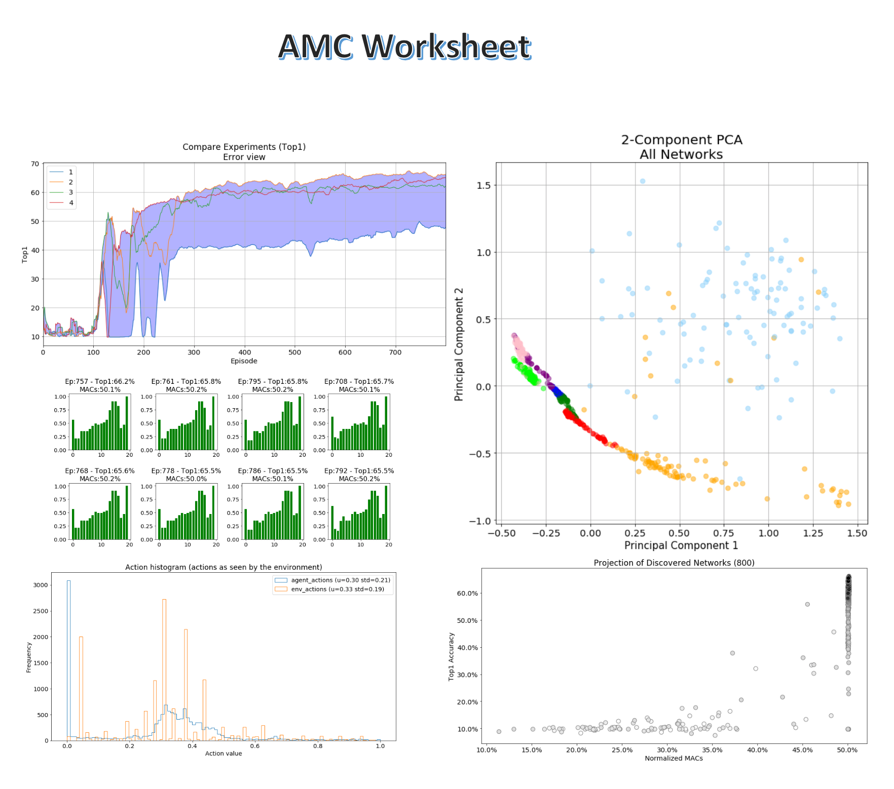

# AMC: AutoML for Model Compression and Acceleration on Mobile Devices

This is a loose implementation of AMC, that allows you to change models and agents and use Jupyter notebooks to examine the learning process in detail.  However details may note exactly match the [implementation](https://github.com/mit-han-lab/amc-compressed-models) from the original paper.

Caveats: 
- This is still a WiP and some information is still missing, such as setup instruction and further documentation.  These will be added with time.
- Some Jupyter examples may contain mistakes in the example command-lines.  Please let us know of any mistakes and bugs you find.
## Notebook examples of AMC applied to compress CNNs:
These notebooks will help visualize and review the results of recreating the results of AMC (resource-constrained compression.).

 

- [AMC worksheet](./jupyter/amc_worksheet.ipynb): work through visualizations of different aspects of AMC learning
- [Random](./jupyter/amc_random.ipynb)
- [Plain20](./jupyter/amc_plain20.ipynb)
- [Resnet20](./jupyter/amc_resnet20.ipynb)
- [Resnet 56]()
- [Mobilenet v1]()
- [Mobilenet v2]()

## At a glance

| Model | FLOPs | Baseline Top1 | AMC paper (Top1 after FT)  | Baseline Top1 | AMC Distiller
| --- |  ---: |  ---: |  ---: |  ---: |  ---: |
| Plain20 | 50% | 90.5 | 90.2 (-0.3) | 90.55 | 90.04 (-0.4)
| Resnet20 | 50%| 91.78 | - | 
| Resnet56 | 50% |92.8 | 91.9 (-0.9)
| Mobilenet v1 | 50% | 70.6 | 70.2 (-0.4)
| Mobilenet v2 |  50% | 71.8 | 70.8 (-1.0)

AMC [1] trains a Deep Deterministic Policy Gradient (DDPG) RL agent to compress DNNs. For the implementation of DDPG we're using [Coach](https://github.com/IntelLabs/coach) or Prof. Han's team's [implementation](https://github.com/mit-han-lab/amc-compressed-models) . We wrap Distiller in an OpenAI [Gym environment API](https://github.com/openai/gym) so that it presents a standard RL environment to the agent. We execute Distiller's sample application [amc.py](https://github.com/IntelLabs/distiller/blob/new_amc/examples/auto_compression/amc/amc.py) with special arguments telling it how to invoke AMC. This creates a DistillerWrapperEnvironment environment and a DDPG agent and starts the training cycle. For the exact technical details of doing this yourself, see the notebooks (better instructions will be added in the future).

We thank Prof. Song Han and his team for their [help](https://github.com/mit-han-lab/amc-compressed-models) with certain critical parts of this implementation.  However, all bugs in interpretation and/or implementation are ours ;-).

## Installation
Our AMC implementation is designed such that you can easily switch between RL libraries (i.e. different agent implementations). The `--amc-rllib` argument instructs us which library to use.
For `--amc-rllib=coach` you need to install coach in your Python virtual-env. The "hanlab" library, `--amc-rllib=hanlab`, refers to HAN Lab's DDPG agent implementation.

### Using Intel AI Lab's Coach
Some of the features required for AMC are not yet in the official [Coach](https://github.com/IntelLabs/coach) release, so you should use the `master` branch.
Therefore, follow Coach's [installation instructions](https://github.com/IntelLabs/coach#installation) for a development environment, and use the `master` branch.
 
Coach uses TensorFlow and Distiller uses PyTorch, and the two frameworks do not share GPUs well.  The easiest work-around for this is to execute Coach code (the RL agent) on the CPU and Distiller code on the GPU(s).
 
To do this, please uninstall TensorFlow: 
`$ pip uninstall tensorflow tensorflow-gpu`
 
and then reinstall TensorFlow:  
`$ pip install tensorflow ` 
 
### Using MIT HAN Lab's DDPG agent
We integrated MIT HAN's Lab's AMC DDPG agent directly into the code base, so there is no explicit effort required to use it.   

## Notable algorithm details

### Feature-map reconstruction

### DDPG Agent
- AMC uses truncated normal distribution for exploration policy
- AMC uses reward shaping 

## References

[1] AMC: AutoML for Model Compression and Acceleration on Mobile Devices. 
     Yihui He, Ji Lin, Zhijian Liu, Hanrui Wang, Li-Jia Li, Song Han. 
     In Proceedings of the European Conference on Computer Vision (ECCV), 2018. 
     [arXiv:1802.03494](https://arxiv.org/abs/1802.03494) 